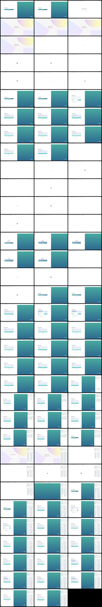

# Video timeline

**Source:** `123651-20260818-1558-43.9170215.mp4`  
**Duration:** 193.299966 seconds  
**Video:** h264, 1896x976

## Contact sheet

## Timeline

| Frame | Timestamp | Review status | Environment | Role | Visual observation | Evidence |
|---|---:|---|---|---|---|---|
| `frames/frame-0001.webp` | `00:00:00.033` | Unreviewed |  |  |  |  |
| `frames/frame-0002.webp` | `00:00:02.067` | Unreviewed |  |  |  |  |
| `frames/frame-0003.webp` | `00:00:03.233` | Unreviewed |  |  |  |  |
| `frames/frame-0004.webp` | `00:00:05.233` | Unreviewed |  |  |  |  |
| `frames/frame-0005.webp` | `00:00:07.233` | Unreviewed |  |  |  |  |
| `frames/frame-0006.webp` | `00:00:09.233` | Unreviewed |  |  |  |  |
| `frames/frame-0007.webp` | `00:00:11.233` | Unreviewed |  |  |  |  |
| `frames/frame-0008.webp` | `00:00:13.233` | Unreviewed |  |  |  |  |
| `frames/frame-0009.webp` | `00:00:15.233` | Unreviewed |  |  |  |  |
| `frames/frame-0010.webp` | `00:00:17.233` | Unreviewed |  |  |  |  |
| `frames/frame-0011.webp` | `00:00:19.233` | Unreviewed |  |  |  |  |
| `frames/frame-0012.webp` | `00:00:21.233` | Unreviewed |  |  |  |  |
| `frames/frame-0013.webp` | `00:00:23.233` | Unreviewed |  |  |  |  |
| `frames/frame-0014.webp` | `00:00:25.233` | Unreviewed |  |  |  |  |
| `frames/frame-0015.webp` | `00:00:27.233` | Unreviewed |  |  |  |  |
| `frames/frame-0016.webp` | `00:00:28.933` | Unreviewed |  |  |  |  |
| `frames/frame-0017.webp` | `00:00:30.933` | Unreviewed |  |  |  |  |
| `frames/frame-0018.webp` | `00:00:32.933` | Unreviewed |  |  |  |  |
| `frames/frame-0019.webp` | `00:00:34.933` | Unreviewed |  |  |  |  |
| `frames/frame-0020.webp` | `00:00:36.933` | Unreviewed |  |  |  |  |
| `frames/frame-0021.webp` | `00:00:38.933` | Unreviewed |  |  |  |  |
| `frames/frame-0022.webp` | `00:00:40.933` | Unreviewed |  |  |  |  |
| `frames/frame-0023.webp` | `00:00:42.933` | Unreviewed |  |  |  |  |
| `frames/frame-0024.webp` | `00:00:44.933` | Unreviewed |  |  |  |  |
| `frames/frame-0025.webp` | `00:00:46.933` | Unreviewed |  |  |  |  |
| `frames/frame-0026.webp` | `00:00:48.933` | Unreviewed |  |  |  |  |
| `frames/frame-0027.webp` | `00:00:50.600` | Unreviewed |  |  |  |  |
| `frames/frame-0028.webp` | `00:00:52.600` | Unreviewed |  |  |  |  |
| `frames/frame-0029.webp` | `00:00:54.600` | Unreviewed |  |  |  |  |
| `frames/frame-0030.webp` | `00:00:56.600` | Unreviewed |  |  |  |  |
| `frames/frame-0031.webp` | `00:00:58.600` | Unreviewed |  |  |  |  |
| `frames/frame-0032.webp` | `00:01:00.600` | Unreviewed |  |  |  |  |
| `frames/frame-0033.webp` | `00:01:02.600` | Unreviewed |  |  |  |  |
| `frames/frame-0034.webp` | `00:01:04.600` | Unreviewed |  |  |  |  |
| `frames/frame-0035.webp` | `00:01:06.600` | Unreviewed |  |  |  |  |
| `frames/frame-0036.webp` | `00:01:08.600` | Unreviewed |  |  |  |  |
| `frames/frame-0037.webp` | `00:01:10.600` | Unreviewed |  |  |  |  |
| `frames/frame-0038.webp` | `00:01:12.600` | Unreviewed |  |  |  |  |
| `frames/frame-0039.webp` | `00:01:14.600` | Unreviewed |  |  |  |  |
| `frames/frame-0040.webp` | `00:01:15.500` | Unreviewed |  |  |  |  |
| `frames/frame-0041.webp` | `00:01:17.500` | Unreviewed |  |  |  |  |
| `frames/frame-0042.webp` | `00:01:19.500` | Unreviewed |  |  |  |  |
| `frames/frame-0043.webp` | `00:01:21.500` | Unreviewed |  |  |  |  |
| `frames/frame-0044.webp` | `00:01:23.500` | Unreviewed |  |  |  |  |
| `frames/frame-0045.webp` | `00:01:25.500` | Unreviewed |  |  |  |  |
| `frames/frame-0046.webp` | `00:01:27.500` | Unreviewed |  |  |  |  |
| `frames/frame-0047.webp` | `00:01:29.500` | Unreviewed |  |  |  |  |
| `frames/frame-0048.webp` | `00:01:31.500` | Unreviewed |  |  |  |  |
| `frames/frame-0049.webp` | `00:01:33.500` | Unreviewed |  |  |  |  |
| `frames/frame-0050.webp` | `00:01:33.600` | Unreviewed |  |  |  |  |
| `frames/frame-0051.webp` | `00:01:35.600` | Unreviewed |  |  |  |  |
| `frames/frame-0052.webp` | `00:01:37.600` | Unreviewed |  |  |  |  |
| `frames/frame-0053.webp` | `00:01:39.600` | Unreviewed |  |  |  |  |
| `frames/frame-0054.webp` | `00:01:41.600` | Unreviewed |  |  |  |  |
| `frames/frame-0055.webp` | `00:01:43.600` | Unreviewed |  |  |  |  |
| `frames/frame-0056.webp` | `00:01:45.600` | Unreviewed |  |  |  |  |
| `frames/frame-0057.webp` | `00:01:47.600` | Unreviewed |  |  |  |  |
| `frames/frame-0058.webp` | `00:01:49.600` | Unreviewed |  |  |  |  |
| `frames/frame-0059.webp` | `00:01:51.600` | Unreviewed |  |  |  |  |
| `frames/frame-0060.webp` | `00:01:53.600` | Unreviewed |  |  |  |  |
| `frames/frame-0061.webp` | `00:01:55.600` | Unreviewed |  |  |  |  |
| `frames/frame-0062.webp` | `00:01:57.600` | Unreviewed |  |  |  |  |
| `frames/frame-0063.webp` | `00:01:59.600` | Unreviewed |  |  |  |  |
| `frames/frame-0064.webp` | `00:02:01.600` | Unreviewed |  |  |  |  |
| `frames/frame-0065.webp` | `00:02:03.600` | Unreviewed |  |  |  |  |
| `frames/frame-0066.webp` | `00:02:04.767` | Unreviewed |  |  |  |  |
| `frames/frame-0067.webp` | `00:02:06.767` | Unreviewed |  |  |  |  |
| `frames/frame-0068.webp` | `00:02:08.767` | Unreviewed |  |  |  |  |
| `frames/frame-0069.webp` | `00:02:10.767` | Unreviewed |  |  |  |  |
| `frames/frame-0070.webp` | `00:02:12.767` | Unreviewed |  |  |  |  |
| `frames/frame-0071.webp` | `00:02:14.767` | Unreviewed |  |  |  |  |
| `frames/frame-0072.webp` | `00:02:16.767` | Unreviewed |  |  |  |  |
| `frames/frame-0073.webp` | `00:02:18.767` | Unreviewed |  |  |  |  |
| `frames/frame-0074.webp` | `00:02:20.767` | Unreviewed |  |  |  |  |
| `frames/frame-0075.webp` | `00:02:22.767` | Unreviewed |  |  |  |  |
| `frames/frame-0076.webp` | `00:02:23.867` | Unreviewed |  |  |  |  |
| `frames/frame-0077.webp` | `00:02:25.867` | Unreviewed |  |  |  |  |
| `frames/frame-0078.webp` | `00:02:27.867` | Unreviewed |  |  |  |  |
| `frames/frame-0079.webp` | `00:02:29.867` | Unreviewed |  |  |  |  |
| `frames/frame-0080.webp` | `00:02:31.867` | Unreviewed |  |  |  |  |
| `frames/frame-0081.webp` | `00:02:33.867` | Unreviewed |  |  |  |  |
| `frames/frame-0082.webp` | `00:02:35.867` | Unreviewed |  |  |  |  |
| `frames/frame-0083.webp` | `00:02:36.100` | Unreviewed |  |  |  |  |
| `frames/frame-0084.webp` | `00:02:37.367` | Unreviewed |  |  |  |  |
| `frames/frame-0085.webp` | `00:02:39.367` | Unreviewed |  |  |  |  |
| `frames/frame-0086.webp` | `00:02:41.367` | Unreviewed |  |  |  |  |
| `frames/frame-0087.webp` | `00:02:43.367` | Unreviewed |  |  |  |  |
| `frames/frame-0088.webp` | `00:02:45.367` | Unreviewed |  |  |  |  |
| `frames/frame-0089.webp` | `00:02:47.367` | Unreviewed |  |  |  |  |
| `frames/frame-0090.webp` | `00:02:49.367` | Unreviewed |  |  |  |  |
| `frames/frame-0091.webp` | `00:02:51.367` | Unreviewed |  |  |  |  |
| `frames/frame-0092.webp` | `00:02:53.367` | Unreviewed |  |  |  |  |
| `frames/frame-0093.webp` | `00:02:55.367` | Unreviewed |  |  |  |  |
| `frames/frame-0094.webp` | `00:02:57.367` | Unreviewed |  |  |  |  |
| `frames/frame-0095.webp` | `00:02:59.367` | Unreviewed |  |  |  |  |
| `frames/frame-0096.webp` | `00:03:01.367` | Unreviewed |  |  |  |  |
| `frames/frame-0097.webp` | `00:03:03.367` | Unreviewed |  |  |  |  |
| `frames/frame-0098.webp` | `00:03:05.367` | Unreviewed |  |  |  |  |
| `frames/frame-0099.webp` | `00:03:07.367` | Unreviewed |  |  |  |  |
| `frames/frame-0100.webp` | `00:03:09.367` | Unreviewed |  |  |  |  |
| `frames/frame-0101.webp` | `00:03:11.367` | Unreviewed |  |  |  |  |

Frame timestamps are technical extraction aids. Record `Observed` only after visual review adds environment, role, observation and evidence reference.

## Open questions

- Review each frame before using it as requirement evidence.

## Tester notes

[Protected area]
