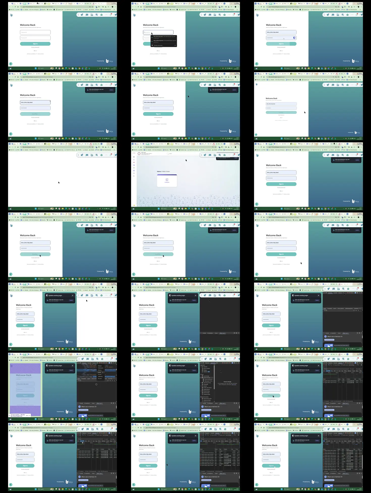

# Video timeline

**Source:** `123768-Screen sharing - 2026-08-19 2_07_08 PM.mp4`  
**Duration:** 37.203700 seconds  
**Video:** h264, 1920x1080

## Contact sheet

## Timeline

| Frame | Timestamp | Review status | Environment | Role | Visual observation | Evidence |
|---|---:|---|---|---|---|---|
| `frames/frame-0001.webp` | `00:00:00.000` | Unreviewed |  |  |  |  |
| `frames/frame-0002.webp` | `00:00:02.012` | Unreviewed |  |  |  |  |
| `frames/frame-0003.webp` | `00:00:04.034` | Unreviewed |  |  |  |  |
| `frames/frame-0004.webp` | `00:00:06.043` | Unreviewed |  |  |  |  |
| `frames/frame-0005.webp` | `00:00:08.067` | Unreviewed |  |  |  |  |
| `frames/frame-0006.webp` | `00:00:10.086` | Unreviewed |  |  |  |  |
| `frames/frame-0007.webp` | `00:00:11.279` | Unreviewed |  |  |  |  |
| `frames/frame-0008.webp` | `00:00:13.303` | Unreviewed |  |  |  |  |
| `frames/frame-0009.webp` | `00:00:14.995` | Unreviewed |  |  |  |  |
| `frames/frame-0010.webp` | `00:00:17.019` | Unreviewed |  |  |  |  |
| `frames/frame-0011.webp` | `00:00:19.038` | Unreviewed |  |  |  |  |
| `frames/frame-0012.webp` | `00:00:21.080` | Unreviewed |  |  |  |  |
| `frames/frame-0013.webp` | `00:00:21.600` | Unreviewed |  |  |  |  |
| `frames/frame-0014.webp` | `00:00:21.691` | Unreviewed |  |  |  |  |
| `frames/frame-0015.webp` | `00:00:23.703` | Unreviewed |  |  |  |  |
| `frames/frame-0016.webp` | `00:00:25.725` | Unreviewed |  |  |  |  |
| `frames/frame-0017.webp` | `00:00:27.755` | Unreviewed |  |  |  |  |
| `frames/frame-0018.webp` | `00:00:29.774` | Unreviewed |  |  |  |  |
| `frames/frame-0019.webp` | `00:00:31.790` | Unreviewed |  |  |  |  |
| `frames/frame-0020.webp` | `00:00:33.822` | Unreviewed |  |  |  |  |
| `frames/frame-0021.webp` | `00:00:35.878` | Unreviewed |  |  |  |  |

Frame timestamps are technical extraction aids. Record `Observed` only after visual review adds environment, role, observation and evidence reference.

## Open questions

- Review each frame before using it as requirement evidence.

## Tester notes

[Protected area]
