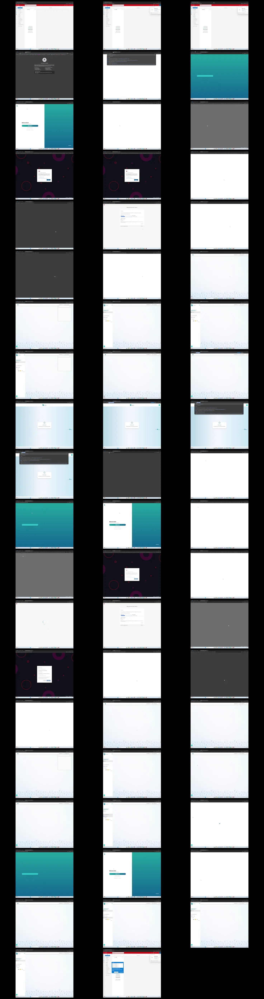

# Video timeline

**Source:** `75954-2025-05-18 12-26-46.mp4`  
**Duration:** 90.366667 seconds  
**Video:** h264, 1920x1080

## Contact sheet

## Timeline

| Frame | Timestamp | Review status | Environment | Role | Visual observation | Evidence |
|---|---:|---|---|---|---|---|
| `frames/frame-0001.webp` | `00:00:00.000` | Unreviewed |  |  |  |  |
| `frames/frame-0002.webp` | `00:00:02.000` | Unreviewed |  |  |  |  |
| `frames/frame-0003.webp` | `00:00:04.000` | Unreviewed |  |  |  |  |
| `frames/frame-0004.webp` | `00:00:05.050` | Unreviewed |  |  |  |  |
| `frames/frame-0005.webp` | `00:00:06.283` | Unreviewed |  |  |  |  |
| `frames/frame-0006.webp` | `00:00:07.317` | Unreviewed |  |  |  |  |
| `frames/frame-0007.webp` | `00:00:07.383` | Unreviewed |  |  |  |  |
| `frames/frame-0008.webp` | `00:00:09.333` | Unreviewed |  |  |  |  |
| `frames/frame-0009.webp` | `00:00:09.433` | Unreviewed |  |  |  |  |
| `frames/frame-0010.webp` | `00:00:11.433` | Unreviewed |  |  |  |  |
| `frames/frame-0011.webp` | `00:00:13.433` | Unreviewed |  |  |  |  |
| `frames/frame-0012.webp` | `00:00:15.233` | Unreviewed |  |  |  |  |
| `frames/frame-0013.webp` | `00:00:15.950` | Unreviewed |  |  |  |  |
| `frames/frame-0014.webp` | `00:00:17.950` | Unreviewed |  |  |  |  |
| `frames/frame-0015.webp` | `00:00:19.950` | Unreviewed |  |  |  |  |
| `frames/frame-0016.webp` | `00:00:20.717` | Unreviewed |  |  |  |  |
| `frames/frame-0017.webp` | `00:00:21.017` | Unreviewed |  |  |  |  |
| `frames/frame-0018.webp` | `00:00:23.017` | Unreviewed |  |  |  |  |
| `frames/frame-0019.webp` | `00:00:25.017` | Unreviewed |  |  |  |  |
| `frames/frame-0020.webp` | `00:00:27.017` | Unreviewed |  |  |  |  |
| `frames/frame-0021.webp` | `00:00:29.017` | Unreviewed |  |  |  |  |
| `frames/frame-0022.webp` | `00:00:31.017` | Unreviewed |  |  |  |  |
| `frames/frame-0023.webp` | `00:00:33.017` | Unreviewed |  |  |  |  |
| `frames/frame-0024.webp` | `00:00:35.017` | Unreviewed |  |  |  |  |
| `frames/frame-0025.webp` | `00:00:37.017` | Unreviewed |  |  |  |  |
| `frames/frame-0026.webp` | `00:00:39.017` | Unreviewed |  |  |  |  |
| `frames/frame-0027.webp` | `00:00:41.017` | Unreviewed |  |  |  |  |
| `frames/frame-0028.webp` | `00:00:43.017` | Unreviewed |  |  |  |  |
| `frames/frame-0029.webp` | `00:00:44.767` | Unreviewed |  |  |  |  |
| `frames/frame-0030.webp` | `00:00:45.083` | Unreviewed |  |  |  |  |
| `frames/frame-0031.webp` | `00:00:46.317` | Unreviewed |  |  |  |  |
| `frames/frame-0032.webp` | `00:00:46.567` | Unreviewed |  |  |  |  |
| `frames/frame-0033.webp` | `00:00:47.867` | Unreviewed |  |  |  |  |
| `frames/frame-0034.webp` | `00:00:47.950` | Unreviewed |  |  |  |  |
| `frames/frame-0035.webp` | `00:00:49.950` | Unreviewed |  |  |  |  |
| `frames/frame-0036.webp` | `00:00:50.150` | Unreviewed |  |  |  |  |
| `frames/frame-0037.webp` | `00:00:52.150` | Unreviewed |  |  |  |  |
| `frames/frame-0038.webp` | `00:00:54.150` | Unreviewed |  |  |  |  |
| `frames/frame-0039.webp` | `00:00:55.683` | Unreviewed |  |  |  |  |
| `frames/frame-0040.webp` | `00:00:57.683` | Unreviewed |  |  |  |  |
| `frames/frame-0041.webp` | `00:00:58.167` | Unreviewed |  |  |  |  |
| `frames/frame-0042.webp` | `00:00:59.767` | Unreviewed |  |  |  |  |
| `frames/frame-0043.webp` | `00:01:00.000` | Unreviewed |  |  |  |  |
| `frames/frame-0044.webp` | `00:01:02.000` | Unreviewed |  |  |  |  |
| `frames/frame-0045.webp` | `00:01:04.000` | Unreviewed |  |  |  |  |
| `frames/frame-0046.webp` | `00:01:06.000` | Unreviewed |  |  |  |  |
| `frames/frame-0047.webp` | `00:01:08.000` | Unreviewed |  |  |  |  |
| `frames/frame-0048.webp` | `00:01:10.000` | Unreviewed |  |  |  |  |
| `frames/frame-0049.webp` | `00:01:12.000` | Unreviewed |  |  |  |  |
| `frames/frame-0050.webp` | `00:01:14.000` | Unreviewed |  |  |  |  |
| `frames/frame-0051.webp` | `00:01:16.000` | Unreviewed |  |  |  |  |
| `frames/frame-0052.webp` | `00:01:17.950` | Unreviewed |  |  |  |  |
| `frames/frame-0053.webp` | `00:01:18.133` | Unreviewed |  |  |  |  |
| `frames/frame-0054.webp` | `00:01:18.600` | Unreviewed |  |  |  |  |
| `frames/frame-0055.webp` | `00:01:20.600` | Unreviewed |  |  |  |  |
| `frames/frame-0056.webp` | `00:01:22.600` | Unreviewed |  |  |  |  |
| `frames/frame-0057.webp` | `00:01:24.600` | Unreviewed |  |  |  |  |
| `frames/frame-0058.webp` | `00:01:26.600` | Unreviewed |  |  |  |  |
| `frames/frame-0059.webp` | `00:01:28.600` | Unreviewed |  |  |  |  |

Frame timestamps are technical extraction aids. Record `Observed` only after visual review adds environment, role, observation and evidence reference.

## Open questions

- Review each frame before using it as requirement evidence.

## Tester notes

[Protected area]
