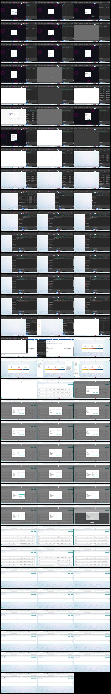

# Video timeline

**Source:** `76121-2025-05-19 12-17-24.mp4`  
**Duration:** 179.416667 seconds  
**Video:** h264, 1920x1080

## Contact sheet

## Timeline

| Frame | Timestamp | Review status | Environment | Role | Visual observation | Evidence |
|---|---:|---|---|---|---|---|
| `frames/frame-0001.webp` | `00:00:00.000` | Unreviewed |  |  |  |  |
| `frames/frame-0002.webp` | `00:00:02.000` | Unreviewed |  |  |  |  |
| `frames/frame-0003.webp` | `00:00:04.000` | Unreviewed |  |  |  |  |
| `frames/frame-0004.webp` | `00:00:06.000` | Unreviewed |  |  |  |  |
| `frames/frame-0005.webp` | `00:00:08.000` | Unreviewed |  |  |  |  |
| `frames/frame-0006.webp` | `00:00:08.350` | Unreviewed |  |  |  |  |
| `frames/frame-0007.webp` | `00:00:10.350` | Unreviewed |  |  |  |  |
| `frames/frame-0008.webp` | `00:00:12.350` | Unreviewed |  |  |  |  |
| `frames/frame-0009.webp` | `00:00:14.350` | Unreviewed |  |  |  |  |
| `frames/frame-0010.webp` | `00:00:16.350` | Unreviewed |  |  |  |  |
| `frames/frame-0011.webp` | `00:00:16.567` | Unreviewed |  |  |  |  |
| `frames/frame-0012.webp` | `00:00:18.567` | Unreviewed |  |  |  |  |
| `frames/frame-0013.webp` | `00:00:20.267` | Unreviewed |  |  |  |  |
| `frames/frame-0014.webp` | `00:00:22.150` | Unreviewed |  |  |  |  |
| `frames/frame-0015.webp` | `00:00:24.150` | Unreviewed |  |  |  |  |
| `frames/frame-0016.webp` | `00:00:26.150` | Unreviewed |  |  |  |  |
| `frames/frame-0017.webp` | `00:00:27.783` | Unreviewed |  |  |  |  |
| `frames/frame-0018.webp` | `00:00:29.783` | Unreviewed |  |  |  |  |
| `frames/frame-0019.webp` | `00:00:31.783` | Unreviewed |  |  |  |  |
| `frames/frame-0020.webp` | `00:00:32.900` | Unreviewed |  |  |  |  |
| `frames/frame-0021.webp` | `00:00:33.367` | Unreviewed |  |  |  |  |
| `frames/frame-0022.webp` | `00:00:33.500` | Unreviewed |  |  |  |  |
| `frames/frame-0023.webp` | `00:00:35.500` | Unreviewed |  |  |  |  |
| `frames/frame-0024.webp` | `00:00:37.500` | Unreviewed |  |  |  |  |
| `frames/frame-0025.webp` | `00:00:39.500` | Unreviewed |  |  |  |  |
| `frames/frame-0026.webp` | `00:00:41.500` | Unreviewed |  |  |  |  |
| `frames/frame-0027.webp` | `00:00:43.500` | Unreviewed |  |  |  |  |
| `frames/frame-0028.webp` | `00:00:45.500` | Unreviewed |  |  |  |  |
| `frames/frame-0029.webp` | `00:00:47.500` | Unreviewed |  |  |  |  |
| `frames/frame-0030.webp` | `00:00:49.500` | Unreviewed |  |  |  |  |
| `frames/frame-0031.webp` | `00:00:51.500` | Unreviewed |  |  |  |  |
| `frames/frame-0032.webp` | `00:00:53.500` | Unreviewed |  |  |  |  |
| `frames/frame-0033.webp` | `00:00:55.500` | Unreviewed |  |  |  |  |
| `frames/frame-0034.webp` | `00:00:57.500` | Unreviewed |  |  |  |  |
| `frames/frame-0035.webp` | `00:00:59.500` | Unreviewed |  |  |  |  |
| `frames/frame-0036.webp` | `00:01:01.500` | Unreviewed |  |  |  |  |
| `frames/frame-0037.webp` | `00:01:03.500` | Unreviewed |  |  |  |  |
| `frames/frame-0038.webp` | `00:01:05.500` | Unreviewed |  |  |  |  |
| `frames/frame-0039.webp` | `00:01:07.500` | Unreviewed |  |  |  |  |
| `frames/frame-0040.webp` | `00:01:09.500` | Unreviewed |  |  |  |  |
| `frames/frame-0041.webp` | `00:01:11.500` | Unreviewed |  |  |  |  |
| `frames/frame-0042.webp` | `00:01:13.500` | Unreviewed |  |  |  |  |
| `frames/frame-0043.webp` | `00:01:15.500` | Unreviewed |  |  |  |  |
| `frames/frame-0044.webp` | `00:01:17.500` | Unreviewed |  |  |  |  |
| `frames/frame-0045.webp` | `00:01:19.500` | Unreviewed |  |  |  |  |
| `frames/frame-0046.webp` | `00:01:21.500` | Unreviewed |  |  |  |  |
| `frames/frame-0047.webp` | `00:01:23.500` | Unreviewed |  |  |  |  |
| `frames/frame-0048.webp` | `00:01:25.500` | Unreviewed |  |  |  |  |
| `frames/frame-0049.webp` | `00:01:26.300` | Unreviewed |  |  |  |  |
| `frames/frame-0050.webp` | `00:01:26.400` | Unreviewed |  |  |  |  |
| `frames/frame-0051.webp` | `00:01:28.400` | Unreviewed |  |  |  |  |
| `frames/frame-0052.webp` | `00:01:30.400` | Unreviewed |  |  |  |  |
| `frames/frame-0053.webp` | `00:01:32.400` | Unreviewed |  |  |  |  |
| `frames/frame-0054.webp` | `00:01:34.400` | Unreviewed |  |  |  |  |
| `frames/frame-0055.webp` | `00:01:36.400` | Unreviewed |  |  |  |  |
| `frames/frame-0056.webp` | `00:01:38.400` | Unreviewed |  |  |  |  |
| `frames/frame-0057.webp` | `00:01:40.400` | Unreviewed |  |  |  |  |
| `frames/frame-0058.webp` | `00:01:42.400` | Unreviewed |  |  |  |  |
| `frames/frame-0059.webp` | `00:01:44.417` | Unreviewed |  |  |  |  |
| `frames/frame-0060.webp` | `00:01:46.417` | Unreviewed |  |  |  |  |
| `frames/frame-0061.webp` | `00:01:48.417` | Unreviewed |  |  |  |  |
| `frames/frame-0062.webp` | `00:01:50.417` | Unreviewed |  |  |  |  |
| `frames/frame-0063.webp` | `00:01:52.417` | Unreviewed |  |  |  |  |
| `frames/frame-0064.webp` | `00:01:54.417` | Unreviewed |  |  |  |  |
| `frames/frame-0065.webp` | `00:01:56.417` | Unreviewed |  |  |  |  |
| `frames/frame-0066.webp` | `00:01:58.417` | Unreviewed |  |  |  |  |
| `frames/frame-0067.webp` | `00:02:00.417` | Unreviewed |  |  |  |  |
| `frames/frame-0068.webp` | `00:02:02.417` | Unreviewed |  |  |  |  |
| `frames/frame-0069.webp` | `00:02:04.417` | Unreviewed |  |  |  |  |
| `frames/frame-0070.webp` | `00:02:06.417` | Unreviewed |  |  |  |  |
| `frames/frame-0071.webp` | `00:02:08.433` | Unreviewed |  |  |  |  |
| `frames/frame-0072.webp` | `00:02:10.433` | Unreviewed |  |  |  |  |
| `frames/frame-0073.webp` | `00:02:12.433` | Unreviewed |  |  |  |  |
| `frames/frame-0074.webp` | `00:02:14.433` | Unreviewed |  |  |  |  |
| `frames/frame-0075.webp` | `00:02:14.500` | Unreviewed |  |  |  |  |
| `frames/frame-0076.webp` | `00:02:14.917` | Unreviewed |  |  |  |  |
| `frames/frame-0077.webp` | `00:02:16.917` | Unreviewed |  |  |  |  |
| `frames/frame-0078.webp` | `00:02:18.917` | Unreviewed |  |  |  |  |
| `frames/frame-0079.webp` | `00:02:20.917` | Unreviewed |  |  |  |  |
| `frames/frame-0080.webp` | `00:02:22.917` | Unreviewed |  |  |  |  |
| `frames/frame-0081.webp` | `00:02:24.917` | Unreviewed |  |  |  |  |
| `frames/frame-0082.webp` | `00:02:26.917` | Unreviewed |  |  |  |  |
| `frames/frame-0083.webp` | `00:02:28.917` | Unreviewed |  |  |  |  |
| `frames/frame-0084.webp` | `00:02:30.917` | Unreviewed |  |  |  |  |
| `frames/frame-0085.webp` | `00:02:32.917` | Unreviewed |  |  |  |  |
| `frames/frame-0086.webp` | `00:02:34.917` | Unreviewed |  |  |  |  |
| `frames/frame-0087.webp` | `00:02:36.917` | Unreviewed |  |  |  |  |
| `frames/frame-0088.webp` | `00:02:38.917` | Unreviewed |  |  |  |  |
| `frames/frame-0089.webp` | `00:02:40.917` | Unreviewed |  |  |  |  |
| `frames/frame-0090.webp` | `00:02:42.917` | Unreviewed |  |  |  |  |
| `frames/frame-0091.webp` | `00:02:44.917` | Unreviewed |  |  |  |  |
| `frames/frame-0092.webp` | `00:02:46.917` | Unreviewed |  |  |  |  |
| `frames/frame-0093.webp` | `00:02:48.917` | Unreviewed |  |  |  |  |
| `frames/frame-0094.webp` | `00:02:50.917` | Unreviewed |  |  |  |  |
| `frames/frame-0095.webp` | `00:02:52.917` | Unreviewed |  |  |  |  |
| `frames/frame-0096.webp` | `00:02:54.917` | Unreviewed |  |  |  |  |
| `frames/frame-0097.webp` | `00:02:56.917` | Unreviewed |  |  |  |  |
| `frames/frame-0098.webp` | `00:02:58.917` | Unreviewed |  |  |  |  |

Frame timestamps are technical extraction aids. Record `Observed` only after visual review adds environment, role, observation and evidence reference.

## Open questions

- Review each frame before using it as requirement evidence.

## Tester notes

[Protected area]
