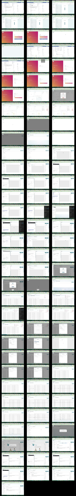

# Video timeline

**Source:** `Screen sharing - 2026-09-29 1_24_51 PM.mp4`  
**Duration:** 172.979396 seconds  
**Video:** h264, 1920x1080

## Contact sheet

## Timeline

| Frame | Timestamp | Review status | Environment | Role | Visual observation | Evidence |
|---|---:|---|---|---|---|---|
| `frames/frame-0001.webp` | `00:00:00.000` | Unreviewed |  |  |  |  |
| `frames/frame-0002.webp` | `00:00:02.028` | Unreviewed |  |  |  |  |
| `frames/frame-0003.webp` | `00:00:04.031` | Unreviewed |  |  |  |  |
| `frames/frame-0004.webp` | `00:00:06.060` | Unreviewed |  |  |  |  |
| `frames/frame-0005.webp` | `00:00:08.073` | Unreviewed |  |  |  |  |
| `frames/frame-0006.webp` | `00:00:10.092` | Unreviewed |  |  |  |  |
| `frames/frame-0007.webp` | `00:00:11.147` | Unreviewed |  |  |  |  |
| `frames/frame-0008.webp` | `00:00:13.170` | Unreviewed |  |  |  |  |
| `frames/frame-0009.webp` | `00:00:13.414` | Unreviewed |  |  |  |  |
| `frames/frame-0010.webp` | `00:00:15.436` | Unreviewed |  |  |  |  |
| `frames/frame-0011.webp` | `00:00:17.443` | Unreviewed |  |  |  |  |
| `frames/frame-0012.webp` | `00:00:19.448` | Unreviewed |  |  |  |  |
| `frames/frame-0013.webp` | `00:00:21.477` | Unreviewed |  |  |  |  |
| `frames/frame-0014.webp` | `00:00:21.816` | Unreviewed |  |  |  |  |
| `frames/frame-0015.webp` | `00:00:23.836` | Unreviewed |  |  |  |  |
| `frames/frame-0016.webp` | `00:00:25.844` | Unreviewed |  |  |  |  |
| `frames/frame-0017.webp` | `00:00:27.896` | Unreviewed |  |  |  |  |
| `frames/frame-0018.webp` | `00:00:29.914` | Unreviewed |  |  |  |  |
| `frames/frame-0019.webp` | `00:00:31.944` | Unreviewed |  |  |  |  |
| `frames/frame-0020.webp` | `00:00:32.157` | Unreviewed |  |  |  |  |
| `frames/frame-0021.webp` | `00:00:33.456` | Unreviewed |  |  |  |  |
| `frames/frame-0022.webp` | `00:00:34.708` | Unreviewed |  |  |  |  |
| `frames/frame-0023.webp` | `00:00:36.711` | Unreviewed |  |  |  |  |
| `frames/frame-0024.webp` | `00:00:38.723` | Unreviewed |  |  |  |  |
| `frames/frame-0025.webp` | `00:00:40.751` | Unreviewed |  |  |  |  |
| `frames/frame-0026.webp` | `00:00:41.093` | Unreviewed |  |  |  |  |
| `frames/frame-0027.webp` | `00:00:41.336` | Unreviewed |  |  |  |  |
| `frames/frame-0028.webp` | `00:00:41.644` | Unreviewed |  |  |  |  |
| `frames/frame-0029.webp` | `00:00:43.048` | Unreviewed |  |  |  |  |
| `frames/frame-0030.webp` | `00:00:45.052` | Unreviewed |  |  |  |  |
| `frames/frame-0031.webp` | `00:00:47.053` | Unreviewed |  |  |  |  |
| `frames/frame-0032.webp` | `00:00:49.060` | Unreviewed |  |  |  |  |
| `frames/frame-0033.webp` | `00:00:51.071` | Unreviewed |  |  |  |  |
| `frames/frame-0034.webp` | `00:00:53.128` | Unreviewed |  |  |  |  |
| `frames/frame-0035.webp` | `00:00:55.133` | Unreviewed |  |  |  |  |
| `frames/frame-0036.webp` | `00:00:57.139` | Unreviewed |  |  |  |  |
| `frames/frame-0037.webp` | `00:00:59.150` | Unreviewed |  |  |  |  |
| `frames/frame-0038.webp` | `00:01:01.165` | Unreviewed |  |  |  |  |
| `frames/frame-0039.webp` | `00:01:03.195` | Unreviewed |  |  |  |  |
| `frames/frame-0040.webp` | `00:01:05.217` | Unreviewed |  |  |  |  |
| `frames/frame-0041.webp` | `00:01:07.230` | Unreviewed |  |  |  |  |
| `frames/frame-0042.webp` | `00:01:09.244` | Unreviewed |  |  |  |  |
| `frames/frame-0043.webp` | `00:01:11.273` | Unreviewed |  |  |  |  |
| `frames/frame-0044.webp` | `00:01:13.273` | Unreviewed |  |  |  |  |
| `frames/frame-0045.webp` | `00:01:15.277` | Unreviewed |  |  |  |  |
| `frames/frame-0046.webp` | `00:01:17.303` | Unreviewed |  |  |  |  |
| `frames/frame-0047.webp` | `00:01:17.897` | Reviewed | dev | `Super Admin GB` | `Blood Pressure` component configuration shows combined O/E tooltip and separate SYS/DIA alternative. | Visual observation; no SNOMED IDs visible. |
| `frames/frame-0048.webp` | `00:01:19.914` | Unreviewed |  |  |  |  |
| `frames/frame-0049.webp` | `00:01:21.918` | Unreviewed |  |  |  |  |
| `frames/frame-0050.webp` | `00:01:23.938` | Unreviewed |  |  |  |  |
| `frames/frame-0051.webp` | `00:01:25.998` | Unreviewed |  |  |  |  |
| `frames/frame-0052.webp` | `00:01:28.021` | Unreviewed |  |  |  |  |
| `frames/frame-0053.webp` | `00:01:30.039` | Unreviewed |  |  |  |  |
| `frames/frame-0054.webp` | `00:01:32.050` | Unreviewed |  |  |  |  |
| `frames/frame-0055.webp` | `00:01:34.068` | Unreviewed |  |  |  |  |
| `frames/frame-0056.webp` | `00:01:36.093` | Unreviewed |  |  |  |  |
| `frames/frame-0057.webp` | `00:01:36.429` | Unreviewed |  |  |  |  |
| `frames/frame-0058.webp` | `00:01:38.439` | Unreviewed |  |  |  |  |
| `frames/frame-0059.webp` | `00:01:38.654` | Unreviewed |  |  |  |  |
| `frames/frame-0060.webp` | `00:01:40.123` | Unreviewed |  |  |  |  |
| `frames/frame-0061.webp` | `00:01:42.152` | Unreviewed |  |  |  |  |
| `frames/frame-0062.webp` | `00:01:44.158` | Unreviewed |  |  |  |  |
| `frames/frame-0063.webp` | `00:01:46.170` | Unreviewed |  |  |  |  |
| `frames/frame-0064.webp` | `00:01:48.178` | Unreviewed |  |  |  |  |
| `frames/frame-0065.webp` | `00:01:48.425` | Unreviewed |  |  |  |  |
| `frames/frame-0066.webp` | `00:01:50.440` | Unreviewed |  |  |  |  |
| `frames/frame-0067.webp` | `00:01:52.445` | Unreviewed |  |  |  |  |
| `frames/frame-0068.webp` | `00:01:53.548` | Unreviewed |  |  |  |  |
| `frames/frame-0069.webp` | `00:01:55.570` | Unreviewed |  |  |  |  |
| `frames/frame-0070.webp` | `00:01:57.596` | Reviewed | dev | `Super Admin GB` | Existing `Blood Pressure Diary` opened in builder; scheduled diary configuration and SYS/DIA fields visible. | Visual observation; no EMIS result or code IDs visible. |
| `frames/frame-0071.webp` | `00:01:59.603` | Unreviewed |  |  |  |  |
| `frames/frame-0072.webp` | `00:02:01.591` | Unreviewed |  |  |  |  |
| `frames/frame-0073.webp` | `00:02:01.772` | Unreviewed |  |  |  |  |
| `frames/frame-0074.webp` | `00:02:03.792` | Unreviewed |  |  |  |  |
| `frames/frame-0075.webp` | `00:02:05.819` | Unreviewed |  |  |  |  |
| `frames/frame-0076.webp` | `00:02:07.837` | Unreviewed |  |  |  |  |
| `frames/frame-0077.webp` | `00:02:09.867` | Unreviewed |  |  |  |  |
| `frames/frame-0078.webp` | `00:02:11.039` | Unreviewed |  |  |  |  |
| `frames/frame-0079.webp` | `00:02:13.058` | Unreviewed |  |  |  |  |
| `frames/frame-0080.webp` | `00:02:15.064` | Reviewed | dev | `Super Admin GB` | Health Form builder remains on blood-pressure form configuration. | Visual observation; no SNOMED IDs visible. |
| `frames/frame-0081.webp` | `00:02:17.073` | Unreviewed |  |  |  |  |
| `frames/frame-0082.webp` | `00:02:19.089` | Unreviewed |  |  |  |  |
| `frames/frame-0083.webp` | `00:02:21.103` | Unreviewed |  |  |  |  |
| `frames/frame-0084.webp` | `00:02:23.125` | Unreviewed |  |  |  |  |
| `frames/frame-0085.webp` | `00:02:25.142` | Unreviewed |  |  |  |  |
| `frames/frame-0086.webp` | `00:02:27.159` | Unreviewed |  |  |  |  |
| `frames/frame-0087.webp` | `00:02:29.187` | Unreviewed |  |  |  |  |
| `frames/frame-0088.webp` | `00:02:31.230` | Unreviewed |  |  |  |  |
| `frames/frame-0089.webp` | `00:02:33.260` | Unreviewed |  |  |  |  |
| `frames/frame-0090.webp` | `00:02:33.568` | Unreviewed |  |  |  |  |
| `frames/frame-0091.webp` | `00:02:34.687` | Unreviewed |  |  |  |  |
| `frames/frame-0092.webp` | `00:02:34.780` | Unreviewed |  |  |  |  |
| `frames/frame-0093.webp` | `00:02:36.829` | Unreviewed |  |  |  |  |
| `frames/frame-0094.webp` | `00:02:38.845` | Unreviewed |  |  |  |  |
| `frames/frame-0095.webp` | `00:02:40.854` | Reviewed | dev | `Super Admin GB` | One-off blood-pressure form builder shows `SYS`/`DIA` inputs. | Visual observation; creation flow only, no EMIS filing verification. |
| `frames/frame-0096.webp` | `00:02:42.876` | Unreviewed |  |  |  |  |
| `frames/frame-0097.webp` | `00:02:44.888` | Unreviewed |  |  |  |  |
| `frames/frame-0098.webp` | `00:02:46.912` | Unreviewed |  |  |  |  |
| `frames/frame-0099.webp` | `00:02:48.925` | Unreviewed |  |  |  |  |
| `frames/frame-0100.webp` | `00:02:50.947` | Reviewed | dev | `Super Admin GB` | Health Form Designer list shows blood-pressure forms after builder activity. | Visual observation; no code mapping or EMIS record shown. |

Frame timestamps are technical extraction aids. Record `Observed` only after visual review adds environment, role, observation and evidence reference.

## Reviewed summary

- `[Observed]` Video chạy trên Paco dev với role `Super Admin GB` trong demo organisation.
- `[Observed]` Video minh họa `Health Form Designer`, cấu hình component `Blood Pressure`, form diary/one-off và inputs `SYS`/`DIA`.
- `[Observed]` Combined O/E label/tooltip xuất hiện trong component configuration.
- `[Observed]` Video không mở EMIS, không file response tới Patient Record, không hiển thị `ConceptID`/`DescriptionID`, payload hay database mapping.
- `[Inferred]` Video hữu ích cho route/setup Health Form, nhưng không đủ chứng minh migration hoặc expected filed code.
- Sensitive patient/account detail không được trích vào timeline.

## Open questions

- Surface/evidence nào xác nhận record đã file vào EMIS với `75367002` / `1495437014`?
- Migration có áp dụng mọi record dùng `163020007` bất kể `DescriptionID`, như câu hỏi trong ticket, hay subset cụ thể?

## Tester notes

[Protected area]
