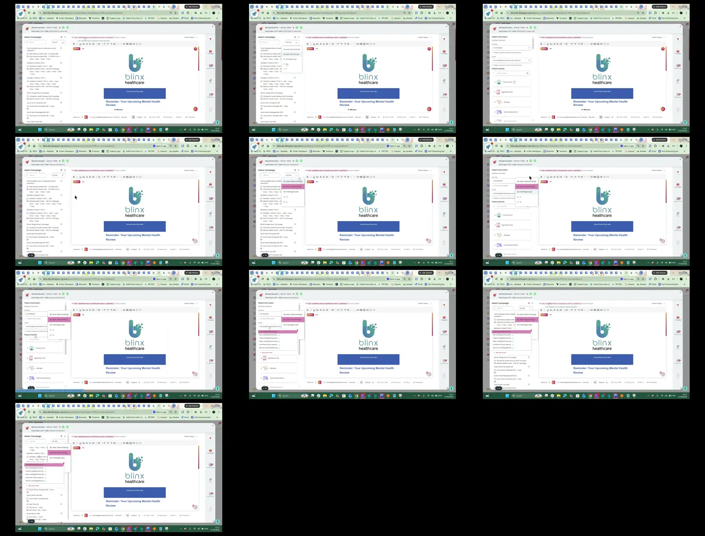

# Video timeline

**Source:** `VID-01.mp4`  
**Duration:** 19.460563 seconds  
**Video:** h264, 1920x1080

## Contact sheet

## Timeline

| Frame | Timestamp | Review status | Environment | Role | Visual observation | Evidence |
|---|---:|---|---|---|---|---|
| `frames/frame-0001.webp` | `00:00:00.000` | Unreviewed |  |  |  |  |
| `frames/frame-0002.webp` | `00:00:02.014` | Unreviewed |  |  |  |  |
| `frames/frame-0003.webp` | `00:00:04.036` | Unreviewed |  |  |  |  |
| `frames/frame-0004.webp` | `00:00:06.062` | Unreviewed |  |  |  |  |
| `frames/frame-0005.webp` | `00:00:08.075` | Unreviewed |  |  |  |  |
| `frames/frame-0006.webp` | `00:00:10.084` | Unreviewed |  |  |  |  |
| `frames/frame-0007.webp` | `00:00:12.103` | Unreviewed |  |  |  |  |
| `frames/frame-0008.webp` | `00:00:14.108` | Unreviewed |  |  |  |  |
| `frames/frame-0009.webp` | `00:00:16.124` | Unreviewed |  |  |  |  |
| `frames/frame-0010.webp` | `00:00:18.139` | Unreviewed |  |  |  |  |

Frame timestamps are technical extraction aids. Record `Observed` only after visual review adds environment, role, observation and evidence reference.

## Open questions

- Review each frame before using it as requirement evidence.

## Tester notes

[Protected area]
