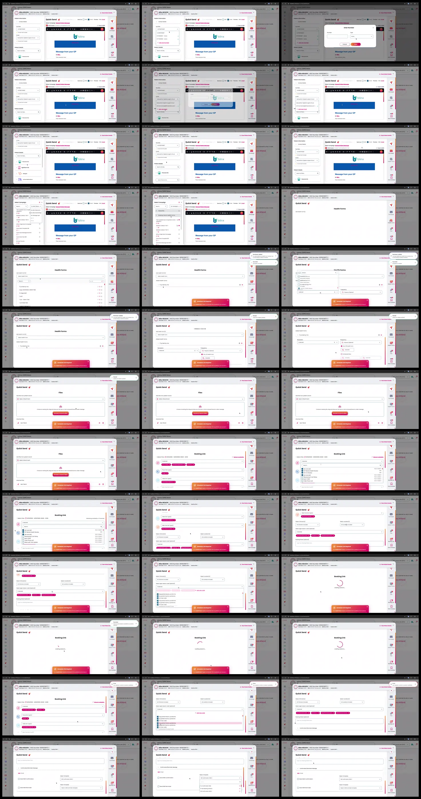

# Video timeline

**Source:** `101185-Screen Recording 2026-02-11 at 23.15.26.mov`  
**Duration:** 76.105000 seconds  
**Video:** h264, 3824x1644

## Contact sheet

## Timeline

| Frame | Timestamp | Review status | Environment | Role | Visual observation | Evidence |
|---|---:|---|---|---|---|---|
| `frames/frame-0001.webp` | `00:00:00.000` | Reviewed | Source recording (2026-02) | Unknown | `Quick Send` flow: patient details, campaign/sort, `Health Forms`, `Files`, `Booking Link`, scheduler prompt. No intent inferred. | Contact sheet reviewed 2026-09-23; contains PII, local only |
| `frames/frame-0002.webp` | `00:00:02.000` | Reviewed | Source recording (2026-02) | Unknown | `Quick Send` flow: patient details, campaign/sort, `Health Forms`, `Files`, `Booking Link`, scheduler prompt. No intent inferred. | Contact sheet reviewed 2026-09-23; contains PII, local only |
| `frames/frame-0003.webp` | `00:00:04.000` | Reviewed | Source recording (2026-02) | Unknown | `Quick Send` flow: patient details, campaign/sort, `Health Forms`, `Files`, `Booking Link`, scheduler prompt. No intent inferred. | Contact sheet reviewed 2026-09-23; contains PII, local only |
| `frames/frame-0004.webp` | `00:00:05.983` | Reviewed | Source recording (2026-02) | Unknown | `Quick Send` flow: patient details, campaign/sort, `Health Forms`, `Files`, `Booking Link`, scheduler prompt. No intent inferred. | Contact sheet reviewed 2026-09-23; contains PII, local only |
| `frames/frame-0005.webp` | `00:00:07.700` | Reviewed | Source recording (2026-02) | Unknown | `Quick Send` flow: patient details, campaign/sort, `Health Forms`, `Files`, `Booking Link`, scheduler prompt. No intent inferred. | Contact sheet reviewed 2026-09-23; contains PII, local only |
| `frames/frame-0006.webp` | `00:00:08.600` | Reviewed | Source recording (2026-02) | Unknown | `Quick Send` flow: patient details, campaign/sort, `Health Forms`, `Files`, `Booking Link`, scheduler prompt. No intent inferred. | Contact sheet reviewed 2026-09-23; contains PII, local only |
| `frames/frame-0007.webp` | `00:00:10.600` | Reviewed | Source recording (2026-02) | Unknown | `Quick Send` flow: patient details, campaign/sort, `Health Forms`, `Files`, `Booking Link`, scheduler prompt. No intent inferred. | Contact sheet reviewed 2026-09-23; contains PII, local only |
| `frames/frame-0008.webp` | `00:00:12.600` | Reviewed | Source recording (2026-02) | Unknown | `Quick Send` flow: patient details, campaign/sort, `Health Forms`, `Files`, `Booking Link`, scheduler prompt. No intent inferred. | Contact sheet reviewed 2026-09-23; contains PII, local only |
| `frames/frame-0009.webp` | `00:00:14.600` | Reviewed | Source recording (2026-02) | Unknown | `Quick Send` flow: patient details, campaign/sort, `Health Forms`, `Files`, `Booking Link`, scheduler prompt. No intent inferred. | Contact sheet reviewed 2026-09-23; contains PII, local only |
| `frames/frame-0010.webp` | `00:00:16.602` | Reviewed | Source recording (2026-02) | Unknown | `Quick Send` flow: patient details, campaign/sort, `Health Forms`, `Files`, `Booking Link`, scheduler prompt. No intent inferred. | Contact sheet reviewed 2026-09-23; contains PII, local only |
| `frames/frame-0011.webp` | `00:00:18.602` | Reviewed | Source recording (2026-02) | Unknown | `Quick Send` flow: patient details, campaign/sort, `Health Forms`, `Files`, `Booking Link`, scheduler prompt. No intent inferred. | Contact sheet reviewed 2026-09-23; contains PII, local only |
| `frames/frame-0012.webp` | `00:00:20.735` | Reviewed | Source recording (2026-02) | Unknown | `Quick Send` flow: patient details, campaign/sort, `Health Forms`, `Files`, `Booking Link`, scheduler prompt. No intent inferred. | Contact sheet reviewed 2026-09-23; contains PII, local only |
| `frames/frame-0013.webp` | `00:00:22.735` | Reviewed | Source recording (2026-02) | Unknown | `Quick Send` flow: patient details, campaign/sort, `Health Forms`, `Files`, `Booking Link`, scheduler prompt. No intent inferred. | Contact sheet reviewed 2026-09-23; contains PII, local only |
| `frames/frame-0014.webp` | `00:00:24.818` | Reviewed | Source recording (2026-02) | Unknown | `Quick Send` flow: patient details, campaign/sort, `Health Forms`, `Files`, `Booking Link`, scheduler prompt. No intent inferred. | Contact sheet reviewed 2026-09-23; contains PII, local only |
| `frames/frame-0015.webp` | `00:00:26.818` | Reviewed | Source recording (2026-02) | Unknown | `Quick Send` flow: patient details, campaign/sort, `Health Forms`, `Files`, `Booking Link`, scheduler prompt. No intent inferred. | Contact sheet reviewed 2026-09-23; contains PII, local only |
| `frames/frame-0016.webp` | `00:00:28.818` | Reviewed | Source recording (2026-02) | Unknown | `Quick Send` flow: patient details, campaign/sort, `Health Forms`, `Files`, `Booking Link`, scheduler prompt. No intent inferred. | Contact sheet reviewed 2026-09-23; contains PII, local only |
| `frames/frame-0017.webp` | `00:00:30.818` | Reviewed | Source recording (2026-02) | Unknown | `Quick Send` flow: patient details, campaign/sort, `Health Forms`, `Files`, `Booking Link`, scheduler prompt. No intent inferred. | Contact sheet reviewed 2026-09-23; contains PII, local only |
| `frames/frame-0018.webp` | `00:00:32.818` | Reviewed | Source recording (2026-02) | Unknown | `Quick Send` flow: patient details, campaign/sort, `Health Forms`, `Files`, `Booking Link`, scheduler prompt. No intent inferred. | Contact sheet reviewed 2026-09-23; contains PII, local only |
| `frames/frame-0019.webp` | `00:00:34.818` | Reviewed | Source recording (2026-02) | Unknown | `Quick Send` flow: patient details, campaign/sort, `Health Forms`, `Files`, `Booking Link`, scheduler prompt. No intent inferred. | Contact sheet reviewed 2026-09-23; contains PII, local only |
| `frames/frame-0020.webp` | `00:00:36.818` | Reviewed | Source recording (2026-02) | Unknown | `Quick Send` flow: patient details, campaign/sort, `Health Forms`, `Files`, `Booking Link`, scheduler prompt. No intent inferred. | Contact sheet reviewed 2026-09-23; contains PII, local only |
| `frames/frame-0021.webp` | `00:00:38.818` | Reviewed | Source recording (2026-02) | Unknown | `Quick Send` flow: patient details, campaign/sort, `Health Forms`, `Files`, `Booking Link`, scheduler prompt. No intent inferred. | Contact sheet reviewed 2026-09-23; contains PII, local only |
| `frames/frame-0022.webp` | `00:00:40.818` | Reviewed | Source recording (2026-02) | Unknown | `Quick Send` flow: patient details, campaign/sort, `Health Forms`, `Files`, `Booking Link`, scheduler prompt. No intent inferred. | Contact sheet reviewed 2026-09-23; contains PII, local only |
| `frames/frame-0023.webp` | `00:00:42.818` | Reviewed | Source recording (2026-02) | Unknown | `Quick Send` flow: patient details, campaign/sort, `Health Forms`, `Files`, `Booking Link`, scheduler prompt. No intent inferred. | Contact sheet reviewed 2026-09-23; contains PII, local only |
| `frames/frame-0024.webp` | `00:00:44.820` | Reviewed | Source recording (2026-02) | Unknown | `Quick Send` flow: patient details, campaign/sort, `Health Forms`, `Files`, `Booking Link`, scheduler prompt. No intent inferred. | Contact sheet reviewed 2026-09-23; contains PII, local only |
| `frames/frame-0025.webp` | `00:00:46.820` | Reviewed | Source recording (2026-02) | Unknown | `Quick Send` flow: patient details, campaign/sort, `Health Forms`, `Files`, `Booking Link`, scheduler prompt. No intent inferred. | Contact sheet reviewed 2026-09-23; contains PII, local only |
| `frames/frame-0026.webp` | `00:00:48.820` | Reviewed | Source recording (2026-02) | Unknown | `Quick Send` flow: patient details, campaign/sort, `Health Forms`, `Files`, `Booking Link`, scheduler prompt. No intent inferred. | Contact sheet reviewed 2026-09-23; contains PII, local only |
| `frames/frame-0027.webp` | `00:00:50.820` | Reviewed | Source recording (2026-02) | Unknown | `Quick Send` flow: patient details, campaign/sort, `Health Forms`, `Files`, `Booking Link`, scheduler prompt. No intent inferred. | Contact sheet reviewed 2026-09-23; contains PII, local only |
| `frames/frame-0028.webp` | `00:00:52.820` | Reviewed | Source recording (2026-02) | Unknown | `Quick Send` flow: patient details, campaign/sort, `Health Forms`, `Files`, `Booking Link`, scheduler prompt. No intent inferred. | Contact sheet reviewed 2026-09-23; contains PII, local only |
| `frames/frame-0029.webp` | `00:00:54.820` | Reviewed | Source recording (2026-02) | Unknown | `Quick Send` flow: patient details, campaign/sort, `Health Forms`, `Files`, `Booking Link`, scheduler prompt. No intent inferred. | Contact sheet reviewed 2026-09-23; contains PII, local only |
| `frames/frame-0030.webp` | `00:00:56.820` | Reviewed | Source recording (2026-02) | Unknown | `Quick Send` flow: patient details, campaign/sort, `Health Forms`, `Files`, `Booking Link`, scheduler prompt. No intent inferred. | Contact sheet reviewed 2026-09-23; contains PII, local only |
| `frames/frame-0031.webp` | `00:00:58.820` | Reviewed | Source recording (2026-02) | Unknown | `Quick Send` flow: patient details, campaign/sort, `Health Forms`, `Files`, `Booking Link`, scheduler prompt. No intent inferred. | Contact sheet reviewed 2026-09-23; contains PII, local only |
| `frames/frame-0032.webp` | `00:01:00.820` | Reviewed | Source recording (2026-02) | Unknown | `Quick Send` flow: patient details, campaign/sort, `Health Forms`, `Files`, `Booking Link`, scheduler prompt. No intent inferred. | Contact sheet reviewed 2026-09-23; contains PII, local only |
| `frames/frame-0033.webp` | `00:01:02.820` | Reviewed | Source recording (2026-02) | Unknown | `Quick Send` flow: patient details, campaign/sort, `Health Forms`, `Files`, `Booking Link`, scheduler prompt. No intent inferred. | Contact sheet reviewed 2026-09-23; contains PII, local only |
| `frames/frame-0034.webp` | `00:01:04.820` | Reviewed | Source recording (2026-02) | Unknown | `Quick Send` flow: patient details, campaign/sort, `Health Forms`, `Files`, `Booking Link`, scheduler prompt. No intent inferred. | Contact sheet reviewed 2026-09-23; contains PII, local only |
| `frames/frame-0035.webp` | `00:01:06.820` | Reviewed | Source recording (2026-02) | Unknown | `Quick Send` flow: patient details, campaign/sort, `Health Forms`, `Files`, `Booking Link`, scheduler prompt. No intent inferred. | Contact sheet reviewed 2026-09-23; contains PII, local only |
| `frames/frame-0036.webp` | `00:01:08.820` | Reviewed | Source recording (2026-02) | Unknown | `Quick Send` flow: patient details, campaign/sort, `Health Forms`, `Files`, `Booking Link`, scheduler prompt. No intent inferred. | Contact sheet reviewed 2026-09-23; contains PII, local only |
| `frames/frame-0037.webp` | `00:01:10.820` | Reviewed | Source recording (2026-02) | Unknown | `Quick Send` flow: patient details, campaign/sort, `Health Forms`, `Files`, `Booking Link`, scheduler prompt. No intent inferred. | Contact sheet reviewed 2026-09-23; contains PII, local only |
| `frames/frame-0038.webp` | `00:01:12.820` | Reviewed | Source recording (2026-02) | Unknown | `Quick Send` flow: patient details, campaign/sort, `Health Forms`, `Files`, `Booking Link`, scheduler prompt. No intent inferred. | Contact sheet reviewed 2026-09-23; contains PII, local only |
| `frames/frame-0039.webp` | `00:01:14.822` | Reviewed | Source recording (2026-02) | Unknown | `Quick Send` flow: patient details, campaign/sort, `Health Forms`, `Files`, `Booking Link`, scheduler prompt. No intent inferred. | Contact sheet reviewed 2026-09-23; contains PII, local only |

Frame timestamps are technical extraction aids. Record `Observed` only after visual review adds environment, role, observation and evidence reference.

## Open questions

- Reviewed visually; environment/role remain unknown. Use as Observed supporting evidence only.

## Tester notes

[Protected area]
