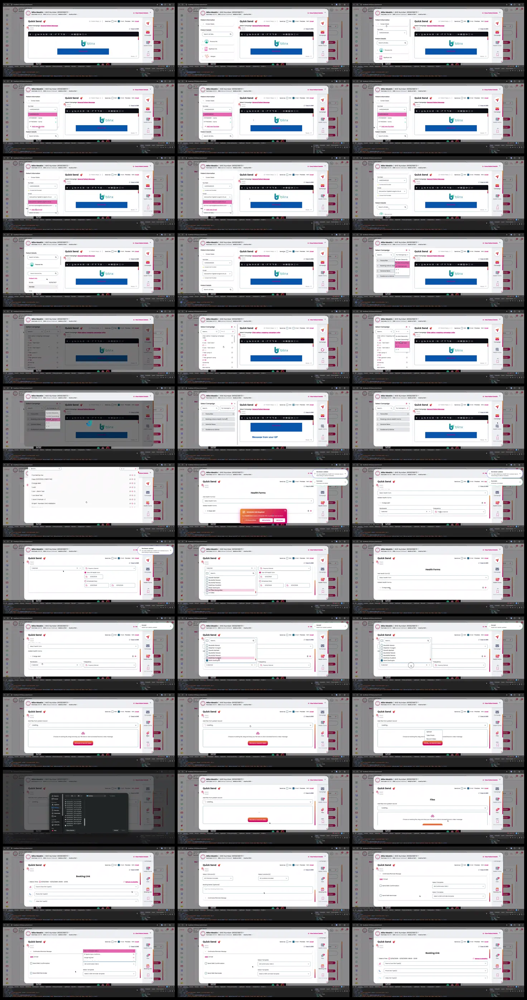

# Video timeline

**Source:** `101186-Screen Recording 2026-02-12 at 00.25.56.mov`  
**Duration:** 70.176667 seconds  
**Video:** h264, 3824x1644

## Contact sheet

## Timeline

| Frame | Timestamp | Review status | Environment | Role | Visual observation | Evidence |
|---|---:|---|---|---|---|---|
| `frames/frame-0001.webp` | `00:00:00.000` | Reviewed | Source recording (2026-02) | Unknown | `Quick Send` flow: patient details, campaign/sort, `Health Forms`, `Files`, `Booking Link`, scheduler prompt. No intent inferred. | Contact sheet reviewed 2026-09-23; contains PII, local only |
| `frames/frame-0002.webp` | `00:00:02.000` | Reviewed | Source recording (2026-02) | Unknown | `Quick Send` flow: patient details, campaign/sort, `Health Forms`, `Files`, `Booking Link`, scheduler prompt. No intent inferred. | Contact sheet reviewed 2026-09-23; contains PII, local only |
| `frames/frame-0003.webp` | `00:00:04.000` | Reviewed | Source recording (2026-02) | Unknown | `Quick Send` flow: patient details, campaign/sort, `Health Forms`, `Files`, `Booking Link`, scheduler prompt. No intent inferred. | Contact sheet reviewed 2026-09-23; contains PII, local only |
| `frames/frame-0004.webp` | `00:00:06.000` | Reviewed | Source recording (2026-02) | Unknown | `Quick Send` flow: patient details, campaign/sort, `Health Forms`, `Files`, `Booking Link`, scheduler prompt. No intent inferred. | Contact sheet reviewed 2026-09-23; contains PII, local only |
| `frames/frame-0005.webp` | `00:00:07.383` | Reviewed | Source recording (2026-02) | Unknown | `Quick Send` flow: patient details, campaign/sort, `Health Forms`, `Files`, `Booking Link`, scheduler prompt. No intent inferred. | Contact sheet reviewed 2026-09-23; contains PII, local only |
| `frames/frame-0006.webp` | `00:00:09.383` | Reviewed | Source recording (2026-02) | Unknown | `Quick Send` flow: patient details, campaign/sort, `Health Forms`, `Files`, `Booking Link`, scheduler prompt. No intent inferred. | Contact sheet reviewed 2026-09-23; contains PII, local only |
| `frames/frame-0007.webp` | `00:00:11.383` | Reviewed | Source recording (2026-02) | Unknown | `Quick Send` flow: patient details, campaign/sort, `Health Forms`, `Files`, `Booking Link`, scheduler prompt. No intent inferred. | Contact sheet reviewed 2026-09-23; contains PII, local only |
| `frames/frame-0008.webp` | `00:00:12.700` | Reviewed | Source recording (2026-02) | Unknown | `Quick Send` flow: patient details, campaign/sort, `Health Forms`, `Files`, `Booking Link`, scheduler prompt. No intent inferred. | Contact sheet reviewed 2026-09-23; contains PII, local only |
| `frames/frame-0009.webp` | `00:00:14.700` | Reviewed | Source recording (2026-02) | Unknown | `Quick Send` flow: patient details, campaign/sort, `Health Forms`, `Files`, `Booking Link`, scheduler prompt. No intent inferred. | Contact sheet reviewed 2026-09-23; contains PII, local only |
| `frames/frame-0010.webp` | `00:00:16.702` | Reviewed | Source recording (2026-02) | Unknown | `Quick Send` flow: patient details, campaign/sort, `Health Forms`, `Files`, `Booking Link`, scheduler prompt. No intent inferred. | Contact sheet reviewed 2026-09-23; contains PII, local only |
| `frames/frame-0011.webp` | `00:00:18.702` | Reviewed | Source recording (2026-02) | Unknown | `Quick Send` flow: patient details, campaign/sort, `Health Forms`, `Files`, `Booking Link`, scheduler prompt. No intent inferred. | Contact sheet reviewed 2026-09-23; contains PII, local only |
| `frames/frame-0012.webp` | `00:00:20.702` | Reviewed | Source recording (2026-02) | Unknown | `Quick Send` flow: patient details, campaign/sort, `Health Forms`, `Files`, `Booking Link`, scheduler prompt. No intent inferred. | Contact sheet reviewed 2026-09-23; contains PII, local only |
| `frames/frame-0013.webp` | `00:00:21.585` | Reviewed | Source recording (2026-02) | Unknown | `Quick Send` flow: patient details, campaign/sort, `Health Forms`, `Files`, `Booking Link`, scheduler prompt. No intent inferred. | Contact sheet reviewed 2026-09-23; contains PII, local only |
| `frames/frame-0014.webp` | `00:00:21.752` | Reviewed | Source recording (2026-02) | Unknown | `Quick Send` flow: patient details, campaign/sort, `Health Forms`, `Files`, `Booking Link`, scheduler prompt. No intent inferred. | Contact sheet reviewed 2026-09-23; contains PII, local only |
| `frames/frame-0015.webp` | `00:00:23.752` | Reviewed | Source recording (2026-02) | Unknown | `Quick Send` flow: patient details, campaign/sort, `Health Forms`, `Files`, `Booking Link`, scheduler prompt. No intent inferred. | Contact sheet reviewed 2026-09-23; contains PII, local only |
| `frames/frame-0016.webp` | `00:00:24.135` | Reviewed | Source recording (2026-02) | Unknown | `Quick Send` flow: patient details, campaign/sort, `Health Forms`, `Files`, `Booking Link`, scheduler prompt. No intent inferred. | Contact sheet reviewed 2026-09-23; contains PII, local only |
| `frames/frame-0017.webp` | `00:00:24.252` | Reviewed | Source recording (2026-02) | Unknown | `Quick Send` flow: patient details, campaign/sort, `Health Forms`, `Files`, `Booking Link`, scheduler prompt. No intent inferred. | Contact sheet reviewed 2026-09-23; contains PII, local only |
| `frames/frame-0018.webp` | `00:00:26.252` | Reviewed | Source recording (2026-02) | Unknown | `Quick Send` flow: patient details, campaign/sort, `Health Forms`, `Files`, `Booking Link`, scheduler prompt. No intent inferred. | Contact sheet reviewed 2026-09-23; contains PII, local only |
| `frames/frame-0019.webp` | `00:00:28.252` | Reviewed | Source recording (2026-02) | Unknown | `Quick Send` flow: patient details, campaign/sort, `Health Forms`, `Files`, `Booking Link`, scheduler prompt. No intent inferred. | Contact sheet reviewed 2026-09-23; contains PII, local only |
| `frames/frame-0020.webp` | `00:00:30.252` | Reviewed | Source recording (2026-02) | Unknown | `Quick Send` flow: patient details, campaign/sort, `Health Forms`, `Files`, `Booking Link`, scheduler prompt. No intent inferred. | Contact sheet reviewed 2026-09-23; contains PII, local only |
| `frames/frame-0021.webp` | `00:00:32.252` | Reviewed | Source recording (2026-02) | Unknown | `Quick Send` flow: patient details, campaign/sort, `Health Forms`, `Files`, `Booking Link`, scheduler prompt. No intent inferred. | Contact sheet reviewed 2026-09-23; contains PII, local only |
| `frames/frame-0022.webp` | `00:00:34.252` | Reviewed | Source recording (2026-02) | Unknown | `Quick Send` flow: patient details, campaign/sort, `Health Forms`, `Files`, `Booking Link`, scheduler prompt. No intent inferred. | Contact sheet reviewed 2026-09-23; contains PII, local only |
| `frames/frame-0023.webp` | `00:00:36.252` | Reviewed | Source recording (2026-02) | Unknown | `Quick Send` flow: patient details, campaign/sort, `Health Forms`, `Files`, `Booking Link`, scheduler prompt. No intent inferred. | Contact sheet reviewed 2026-09-23; contains PII, local only |
| `frames/frame-0024.webp` | `00:00:38.252` | Reviewed | Source recording (2026-02) | Unknown | `Quick Send` flow: patient details, campaign/sort, `Health Forms`, `Files`, `Booking Link`, scheduler prompt. No intent inferred. | Contact sheet reviewed 2026-09-23; contains PII, local only |
| `frames/frame-0025.webp` | `00:00:40.252` | Reviewed | Source recording (2026-02) | Unknown | `Quick Send` flow: patient details, campaign/sort, `Health Forms`, `Files`, `Booking Link`, scheduler prompt. No intent inferred. | Contact sheet reviewed 2026-09-23; contains PII, local only |
| `frames/frame-0026.webp` | `00:00:42.252` | Reviewed | Source recording (2026-02) | Unknown | `Quick Send` flow: patient details, campaign/sort, `Health Forms`, `Files`, `Booking Link`, scheduler prompt. No intent inferred. | Contact sheet reviewed 2026-09-23; contains PII, local only |
| `frames/frame-0027.webp` | `00:00:44.253` | Reviewed | Source recording (2026-02) | Unknown | `Quick Send` flow: patient details, campaign/sort, `Health Forms`, `Files`, `Booking Link`, scheduler prompt. No intent inferred. | Contact sheet reviewed 2026-09-23; contains PII, local only |
| `frames/frame-0028.webp` | `00:00:46.253` | Reviewed | Source recording (2026-02) | Unknown | `Quick Send` flow: patient details, campaign/sort, `Health Forms`, `Files`, `Booking Link`, scheduler prompt. No intent inferred. | Contact sheet reviewed 2026-09-23; contains PII, local only |
| `frames/frame-0029.webp` | `00:00:48.253` | Reviewed | Source recording (2026-02) | Unknown | `Quick Send` flow: patient details, campaign/sort, `Health Forms`, `Files`, `Booking Link`, scheduler prompt. No intent inferred. | Contact sheet reviewed 2026-09-23; contains PII, local only |
| `frames/frame-0030.webp` | `00:00:50.253` | Reviewed | Source recording (2026-02) | Unknown | `Quick Send` flow: patient details, campaign/sort, `Health Forms`, `Files`, `Booking Link`, scheduler prompt. No intent inferred. | Contact sheet reviewed 2026-09-23; contains PII, local only |
| `frames/frame-0031.webp` | `00:00:52.253` | Reviewed | Source recording (2026-02) | Unknown | `Quick Send` flow: patient details, campaign/sort, `Health Forms`, `Files`, `Booking Link`, scheduler prompt. No intent inferred. | Contact sheet reviewed 2026-09-23; contains PII, local only |
| `frames/frame-0032.webp` | `00:00:54.253` | Reviewed | Source recording (2026-02) | Unknown | `Quick Send` flow: patient details, campaign/sort, `Health Forms`, `Files`, `Booking Link`, scheduler prompt. No intent inferred. | Contact sheet reviewed 2026-09-23; contains PII, local only |
| `frames/frame-0033.webp` | `00:00:56.253` | Reviewed | Source recording (2026-02) | Unknown | `Quick Send` flow: patient details, campaign/sort, `Health Forms`, `Files`, `Booking Link`, scheduler prompt. No intent inferred. | Contact sheet reviewed 2026-09-23; contains PII, local only |
| `frames/frame-0034.webp` | `00:00:58.253` | Reviewed | Source recording (2026-02) | Unknown | `Quick Send` flow: patient details, campaign/sort, `Health Forms`, `Files`, `Booking Link`, scheduler prompt. No intent inferred. | Contact sheet reviewed 2026-09-23; contains PII, local only |
| `frames/frame-0035.webp` | `00:01:00.253` | Reviewed | Source recording (2026-02) | Unknown | `Quick Send` flow: patient details, campaign/sort, `Health Forms`, `Files`, `Booking Link`, scheduler prompt. No intent inferred. | Contact sheet reviewed 2026-09-23; contains PII, local only |
| `frames/frame-0036.webp` | `00:01:02.953` | Reviewed | Source recording (2026-02) | Unknown | `Quick Send` flow: patient details, campaign/sort, `Health Forms`, `Files`, `Booking Link`, scheduler prompt. No intent inferred. | Contact sheet reviewed 2026-09-23; contains PII, local only |
| `frames/frame-0037.webp` | `00:01:04.970` | Reviewed | Source recording (2026-02) | Unknown | `Quick Send` flow: patient details, campaign/sort, `Health Forms`, `Files`, `Booking Link`, scheduler prompt. No intent inferred. | Contact sheet reviewed 2026-09-23; contains PII, local only |
| `frames/frame-0038.webp` | `00:01:06.970` | Reviewed | Source recording (2026-02) | Unknown | `Quick Send` flow: patient details, campaign/sort, `Health Forms`, `Files`, `Booking Link`, scheduler prompt. No intent inferred. | Contact sheet reviewed 2026-09-23; contains PII, local only |
| `frames/frame-0039.webp` | `00:01:09.953` | Reviewed | Source recording (2026-02) | Unknown | `Quick Send` flow: patient details, campaign/sort, `Health Forms`, `Files`, `Booking Link`, scheduler prompt. No intent inferred. | Contact sheet reviewed 2026-09-23; contains PII, local only |

Frame timestamps are technical extraction aids. Record `Observed` only after visual review adds environment, role, observation and evidence reference.

## Open questions

- Reviewed visually; environment/role remain unknown. Use as Observed supporting evidence only.

## Tester notes

[Protected area]
