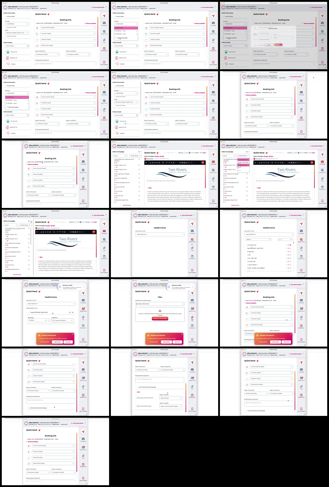

# Video timeline

**Source:** `101694-Screen Recording 2026-02-16 at 16.39.00.mov`  
**Duration:** 33.398333 seconds  
**Video:** h264, 2938x1848

## Contact sheet

## Timeline

| Frame | Timestamp | Review status | Environment | Role | Visual observation | Evidence |
|---|---:|---|---|---|---|---|
| `frames/frame-0001.webp` | `00:00:00.000` | Reviewed | Source recording (2026-02) | Unknown | `Quick Send` flow: patient details, campaign/sort, `Health Forms`, `Files`, `Booking Link`, scheduler prompt. No intent inferred. | Contact sheet reviewed 2026-09-23; contains PII, local only |
| `frames/frame-0002.webp` | `00:00:02.033` | Reviewed | Source recording (2026-02) | Unknown | `Quick Send` flow: patient details, campaign/sort, `Health Forms`, `Files`, `Booking Link`, scheduler prompt. No intent inferred. | Contact sheet reviewed 2026-09-23; contains PII, local only |
| `frames/frame-0003.webp` | `00:00:02.050` | Reviewed | Source recording (2026-02) | Unknown | `Quick Send` flow: patient details, campaign/sort, `Health Forms`, `Files`, `Booking Link`, scheduler prompt. No intent inferred. | Contact sheet reviewed 2026-09-23; contains PII, local only |
| `frames/frame-0004.webp` | `00:00:03.250` | Reviewed | Source recording (2026-02) | Unknown | `Quick Send` flow: patient details, campaign/sort, `Health Forms`, `Files`, `Booking Link`, scheduler prompt. No intent inferred. | Contact sheet reviewed 2026-09-23; contains PII, local only |
| `frames/frame-0005.webp` | `00:00:05.250` | Reviewed | Source recording (2026-02) | Unknown | `Quick Send` flow: patient details, campaign/sort, `Health Forms`, `Files`, `Booking Link`, scheduler prompt. No intent inferred. | Contact sheet reviewed 2026-09-23; contains PII, local only |
| `frames/frame-0006.webp` | `00:00:07.250` | Reviewed | Source recording (2026-02) | Unknown | `Quick Send` flow: patient details, campaign/sort, `Health Forms`, `Files`, `Booking Link`, scheduler prompt. No intent inferred. | Contact sheet reviewed 2026-09-23; contains PII, local only |
| `frames/frame-0007.webp` | `00:00:09.267` | Reviewed | Source recording (2026-02) | Unknown | `Quick Send` flow: patient details, campaign/sort, `Health Forms`, `Files`, `Booking Link`, scheduler prompt. No intent inferred. | Contact sheet reviewed 2026-09-23; contains PII, local only |
| `frames/frame-0008.webp` | `00:00:11.267` | Reviewed | Source recording (2026-02) | Unknown | `Quick Send` flow: patient details, campaign/sort, `Health Forms`, `Files`, `Booking Link`, scheduler prompt. No intent inferred. | Contact sheet reviewed 2026-09-23; contains PII, local only |
| `frames/frame-0009.webp` | `00:00:13.267` | Reviewed | Source recording (2026-02) | Unknown | `Quick Send` flow: patient details, campaign/sort, `Health Forms`, `Files`, `Booking Link`, scheduler prompt. No intent inferred. | Contact sheet reviewed 2026-09-23; contains PII, local only |
| `frames/frame-0010.webp` | `00:00:15.268` | Reviewed | Source recording (2026-02) | Unknown | `Quick Send` flow: patient details, campaign/sort, `Health Forms`, `Files`, `Booking Link`, scheduler prompt. No intent inferred. | Contact sheet reviewed 2026-09-23; contains PII, local only |
| `frames/frame-0011.webp` | `00:00:17.268` | Reviewed | Source recording (2026-02) | Unknown | `Quick Send` flow: patient details, campaign/sort, `Health Forms`, `Files`, `Booking Link`, scheduler prompt. No intent inferred. | Contact sheet reviewed 2026-09-23; contains PII, local only |
| `frames/frame-0012.webp` | `00:00:19.268` | Reviewed | Source recording (2026-02) | Unknown | `Quick Send` flow: patient details, campaign/sort, `Health Forms`, `Files`, `Booking Link`, scheduler prompt. No intent inferred. | Contact sheet reviewed 2026-09-23; contains PII, local only |
| `frames/frame-0013.webp` | `00:00:21.268` | Reviewed | Source recording (2026-02) | Unknown | `Quick Send` flow: patient details, campaign/sort, `Health Forms`, `Files`, `Booking Link`, scheduler prompt. No intent inferred. | Contact sheet reviewed 2026-09-23; contains PII, local only |
| `frames/frame-0014.webp` | `00:00:23.268` | Reviewed | Source recording (2026-02) | Unknown | `Quick Send` flow: patient details, campaign/sort, `Health Forms`, `Files`, `Booking Link`, scheduler prompt. No intent inferred. | Contact sheet reviewed 2026-09-23; contains PII, local only |
| `frames/frame-0015.webp` | `00:00:25.268` | Reviewed | Source recording (2026-02) | Unknown | `Quick Send` flow: patient details, campaign/sort, `Health Forms`, `Files`, `Booking Link`, scheduler prompt. No intent inferred. | Contact sheet reviewed 2026-09-23; contains PII, local only |
| `frames/frame-0016.webp` | `00:00:27.268` | Reviewed | Source recording (2026-02) | Unknown | `Quick Send` flow: patient details, campaign/sort, `Health Forms`, `Files`, `Booking Link`, scheduler prompt. No intent inferred. | Contact sheet reviewed 2026-09-23; contains PII, local only |
| `frames/frame-0017.webp` | `00:00:29.335` | Reviewed | Source recording (2026-02) | Unknown | `Quick Send` flow: patient details, campaign/sort, `Health Forms`, `Files`, `Booking Link`, scheduler prompt. No intent inferred. | Contact sheet reviewed 2026-09-23; contains PII, local only |
| `frames/frame-0018.webp` | `00:00:31.352` | Reviewed | Source recording (2026-02) | Unknown | `Quick Send` flow: patient details, campaign/sort, `Health Forms`, `Files`, `Booking Link`, scheduler prompt. No intent inferred. | Contact sheet reviewed 2026-09-23; contains PII, local only |
| `frames/frame-0019.webp` | `00:00:33.368` | Reviewed | Source recording (2026-02) | Unknown | `Quick Send` flow: patient details, campaign/sort, `Health Forms`, `Files`, `Booking Link`, scheduler prompt. No intent inferred. | Contact sheet reviewed 2026-09-23; contains PII, local only |

Frame timestamps are technical extraction aids. Record `Observed` only after visual review adds environment, role, observation and evidence reference.

## Open questions

- Reviewed visually; environment/role remain unknown. Use as Observed supporting evidence only.

## Tester notes

[Protected area]
