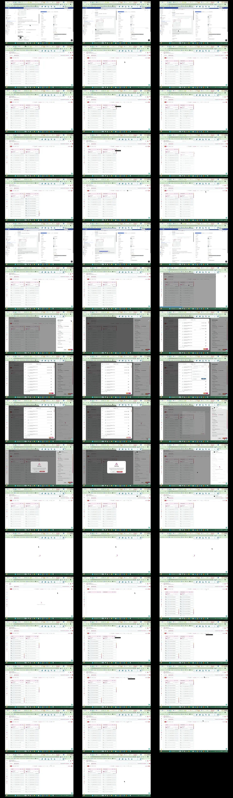

# Video timeline

**Source:** `117381-Screen sharing - 2026-07-03 1_40_15 PM.mp4`  
**Duration:** 94.680700 seconds  
**Video:** h264, 1920x1080

## Contact sheet

## Timeline

| Frame | Timestamp | Review status | Environment | Role | Visual observation | Evidence |
|---|---:|---|---|---|---|---|
| `frames/frame-0001.webp` | `00:00:00.000` | Unreviewed |  |  |  |  |
| `frames/frame-0002.webp` | `00:00:02.003` | Unreviewed |  |  |  |  |
| `frames/frame-0003.webp` | `00:00:04.013` | Unreviewed |  |  |  |  |
| `frames/frame-0004.webp` | `00:00:06.019` | Unreviewed |  |  |  |  |
| `frames/frame-0005.webp` | `00:00:08.036` | Unreviewed |  |  |  |  |
| `frames/frame-0006.webp` | `00:00:10.040` | Unreviewed |  |  |  |  |
| `frames/frame-0007.webp` | `00:00:12.078` | Unreviewed |  |  |  |  |
| `frames/frame-0008.webp` | `00:00:14.094` | Unreviewed |  |  |  |  |
| `frames/frame-0009.webp` | `00:00:16.103` | Unreviewed |  |  |  |  |
| `frames/frame-0010.webp` | `00:00:18.112` | Unreviewed |  |  |  |  |
| `frames/frame-0011.webp` | `00:00:20.120` | Unreviewed |  |  |  |  |
| `frames/frame-0012.webp` | `00:00:22.128` | Unreviewed |  |  |  |  |
| `frames/frame-0013.webp` | `00:00:24.132` | Unreviewed |  |  |  |  |
| `frames/frame-0014.webp` | `00:00:26.134` | Unreviewed |  |  |  |  |
| `frames/frame-0015.webp` | `00:00:28.165` | Unreviewed |  |  |  |  |
| `frames/frame-0016.webp` | `00:00:30.194` | Unreviewed |  |  |  |  |
| `frames/frame-0017.webp` | `00:00:32.223` | Unreviewed |  |  |  |  |
| `frames/frame-0018.webp` | `00:00:34.229` | Unreviewed |  |  |  |  |
| `frames/frame-0019.webp` | `00:00:36.243` | Unreviewed |  |  |  |  |
| `frames/frame-0020.webp` | `00:00:38.249` | Unreviewed |  |  |  |  |
| `frames/frame-0021.webp` | `00:00:38.995` | Unreviewed |  |  |  |  |
| `frames/frame-0022.webp` | `00:00:41.006` | Unreviewed |  |  |  |  |
| `frames/frame-0023.webp` | `00:00:41.858` | Unreviewed |  |  |  |  |
| `frames/frame-0024.webp` | `00:00:42.227` | Unreviewed |  |  |  |  |
| `frames/frame-0025.webp` | `00:00:44.231` | Unreviewed |  |  |  |  |
| `frames/frame-0026.webp` | `00:00:46.258` | Unreviewed |  |  |  |  |
| `frames/frame-0027.webp` | `00:00:48.273` | Unreviewed |  |  |  |  |
| `frames/frame-0028.webp` | `00:00:50.277` | Unreviewed |  |  |  |  |
| `frames/frame-0029.webp` | `00:00:52.295` | Unreviewed |  |  |  |  |
| `frames/frame-0030.webp` | `00:00:52.912` | Unreviewed |  |  |  |  |
| `frames/frame-0031.webp` | `00:00:53.460` | Unreviewed |  |  |  |  |
| `frames/frame-0032.webp` | `00:00:53.520` | Unreviewed |  |  |  |  |
| `frames/frame-0033.webp` | `00:00:54.523` | Unreviewed |  |  |  |  |
| `frames/frame-0034.webp` | `00:00:55.959` | Unreviewed |  |  |  |  |
| `frames/frame-0035.webp` | `00:00:57.965` | Unreviewed |  |  |  |  |
| `frames/frame-0036.webp` | `00:00:59.972` | Unreviewed |  |  |  |  |
| `frames/frame-0037.webp` | `00:01:01.981` | Unreviewed |  |  |  |  |
| `frames/frame-0038.webp` | `00:01:03.986` | Unreviewed |  |  |  |  |
| `frames/frame-0039.webp` | `00:01:05.986` | Unreviewed |  |  |  |  |
| `frames/frame-0040.webp` | `00:01:07.994` | Unreviewed |  |  |  |  |
| `frames/frame-0041.webp` | `00:01:10.001` | Unreviewed |  |  |  |  |
| `frames/frame-0042.webp` | `00:01:12.011` | Unreviewed |  |  |  |  |
| `frames/frame-0043.webp` | `00:01:14.028` | Unreviewed |  |  |  |  |
| `frames/frame-0044.webp` | `00:01:16.038` | Unreviewed |  |  |  |  |
| `frames/frame-0045.webp` | `00:01:18.078` | Unreviewed |  |  |  |  |
| `frames/frame-0046.webp` | `00:01:20.112` | Unreviewed |  |  |  |  |
| `frames/frame-0047.webp` | `00:01:22.135` | Unreviewed |  |  |  |  |
| `frames/frame-0048.webp` | `00:01:24.140` | Unreviewed |  |  |  |  |
| `frames/frame-0049.webp` | `00:01:26.145` | Unreviewed |  |  |  |  |
| `frames/frame-0050.webp` | `00:01:28.159` | Unreviewed |  |  |  |  |
| `frames/frame-0051.webp` | `00:01:30.166` | Unreviewed |  |  |  |  |
| `frames/frame-0052.webp` | `00:01:32.179` | Unreviewed |  |  |  |  |
| `frames/frame-0053.webp` | `00:01:34.187` | Unreviewed |  |  |  |  |

Frame timestamps are technical extraction aids. Record `Observed` only after visual review adds environment, role, observation and evidence reference.

## Open questions

- Review each frame before using it as requirement evidence.

## Tester notes

[Protected area]
