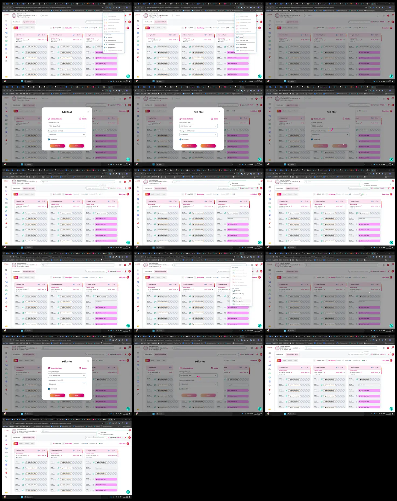

# Video timeline

**Source:** `117419-20260703-1813-51.5665139.mp4`  
**Duration:** 28.927979 seconds  
**Video:** h264, 1918x1198

## Contact sheet

## Timeline

| Frame | Timestamp | Review status | Environment | Role | Visual observation | Evidence |
|---|---:|---|---|---|---|---|
| `frames/frame-0001.webp` | `00:00:00.033` | Unreviewed |  |  |  |  |
| `frames/frame-0002.webp` | `00:00:02.067` | Unreviewed |  |  |  |  |
| `frames/frame-0003.webp` | `00:00:02.967` | Unreviewed |  |  |  |  |
| `frames/frame-0004.webp` | `00:00:04.967` | Unreviewed |  |  |  |  |
| `frames/frame-0005.webp` | `00:00:06.967` | Unreviewed |  |  |  |  |
| `frames/frame-0006.webp` | `00:00:08.967` | Unreviewed |  |  |  |  |
| `frames/frame-0007.webp` | `00:00:10.067` | Unreviewed |  |  |  |  |
| `frames/frame-0008.webp` | `00:00:12.067` | Unreviewed |  |  |  |  |
| `frames/frame-0009.webp` | `00:00:14.067` | Unreviewed |  |  |  |  |
| `frames/frame-0010.webp` | `00:00:16.100` | Unreviewed |  |  |  |  |
| `frames/frame-0011.webp` | `00:00:18.100` | Unreviewed |  |  |  |  |
| `frames/frame-0012.webp` | `00:00:20.067` | Unreviewed |  |  |  |  |
| `frames/frame-0013.webp` | `00:00:22.067` | Unreviewed |  |  |  |  |
| `frames/frame-0014.webp` | `00:00:24.067` | Unreviewed |  |  |  |  |
| `frames/frame-0015.webp` | `00:00:25.267` | Unreviewed |  |  |  |  |
| `frames/frame-0016.webp` | `00:00:27.267` | Unreviewed |  |  |  |  |

Frame timestamps are technical extraction aids. Record `Observed` only after visual review adds environment, role, observation and evidence reference.

## Open questions

- Review each frame before using it as requirement evidence.

## Tester notes

[Protected area]
