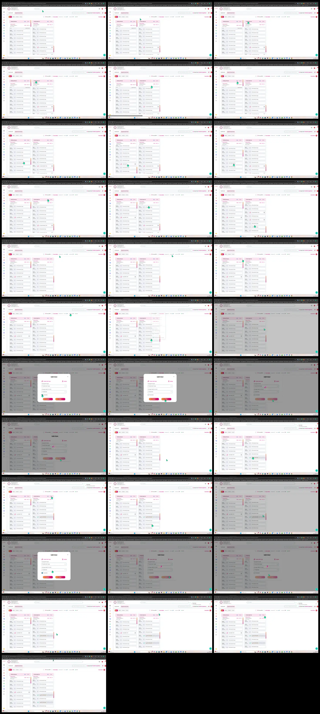

# Video timeline

**Source:** `117623-20260706-1317-12.2371613.mp4`  
**Duration:** 63.500000 seconds  
**Video:** h264, 1898x1044

## Contact sheet

## Timeline

| Frame | Timestamp | Review status | Environment | Role | Visual observation | Evidence |
|---|---:|---|---|---|---|---|
| `frames/frame-0001.webp` | `00:00:00.000` | Unreviewed |  |  |  |  |
| `frames/frame-0002.webp` | `00:00:02.000` | Unreviewed |  |  |  |  |
| `frames/frame-0003.webp` | `00:00:04.000` | Unreviewed |  |  |  |  |
| `frames/frame-0004.webp` | `00:00:06.000` | Unreviewed |  |  |  |  |
| `frames/frame-0005.webp` | `00:00:08.000` | Unreviewed |  |  |  |  |
| `frames/frame-0006.webp` | `00:00:10.000` | Unreviewed |  |  |  |  |
| `frames/frame-0007.webp` | `00:00:12.000` | Unreviewed |  |  |  |  |
| `frames/frame-0008.webp` | `00:00:14.000` | Unreviewed |  |  |  |  |
| `frames/frame-0009.webp` | `00:00:16.000` | Unreviewed |  |  |  |  |
| `frames/frame-0010.webp` | `00:00:18.000` | Unreviewed |  |  |  |  |
| `frames/frame-0011.webp` | `00:00:20.000` | Unreviewed |  |  |  |  |
| `frames/frame-0012.webp` | `00:00:22.000` | Unreviewed |  |  |  |  |
| `frames/frame-0013.webp` | `00:00:24.000` | Unreviewed |  |  |  |  |
| `frames/frame-0014.webp` | `00:00:26.000` | Unreviewed |  |  |  |  |
| `frames/frame-0015.webp` | `00:00:28.000` | Unreviewed |  |  |  |  |
| `frames/frame-0016.webp` | `00:00:30.000` | Unreviewed |  |  |  |  |
| `frames/frame-0017.webp` | `00:00:32.000` | Unreviewed |  |  |  |  |
| `frames/frame-0018.webp` | `00:00:33.533` | Unreviewed |  |  |  |  |
| `frames/frame-0019.webp` | `00:00:35.533` | Unreviewed |  |  |  |  |
| `frames/frame-0020.webp` | `00:00:37.533` | Unreviewed |  |  |  |  |
| `frames/frame-0021.webp` | `00:00:39.533` | Unreviewed |  |  |  |  |
| `frames/frame-0022.webp` | `00:00:41.533` | Unreviewed |  |  |  |  |
| `frames/frame-0023.webp` | `00:00:43.033` | Unreviewed |  |  |  |  |
| `frames/frame-0024.webp` | `00:00:45.033` | Unreviewed |  |  |  |  |
| `frames/frame-0025.webp` | `00:00:47.033` | Unreviewed |  |  |  |  |
| `frames/frame-0026.webp` | `00:00:49.033` | Unreviewed |  |  |  |  |
| `frames/frame-0027.webp` | `00:00:50.633` | Unreviewed |  |  |  |  |
| `frames/frame-0028.webp` | `00:00:52.633` | Unreviewed |  |  |  |  |
| `frames/frame-0029.webp` | `00:00:54.633` | Unreviewed |  |  |  |  |
| `frames/frame-0030.webp` | `00:00:56.633` | Unreviewed |  |  |  |  |
| `frames/frame-0031.webp` | `00:00:56.833` | Unreviewed |  |  |  |  |
| `frames/frame-0032.webp` | `00:00:58.833` | Unreviewed |  |  |  |  |
| `frames/frame-0033.webp` | `00:01:00.833` | Unreviewed |  |  |  |  |
| `frames/frame-0034.webp` | `00:01:02.833` | Unreviewed |  |  |  |  |

Frame timestamps are technical extraction aids. Record `Observed` only after visual review adds environment, role, observation and evidence reference.

## Open questions

- Review each frame before using it as requirement evidence.

## Tester notes

[Protected area]
