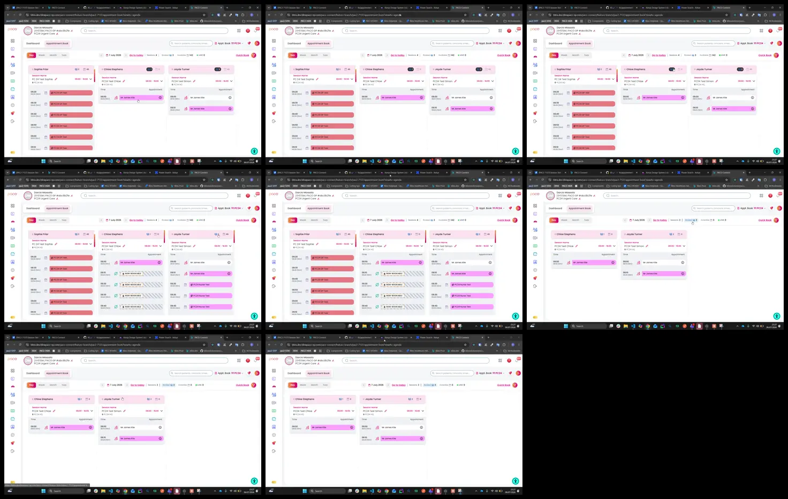

# Video timeline

**Source:** `117731-20260706-2227-10.5886819.mp4`  
**Duration:** 14.357313 seconds  
**Video:** h264, 1918x1198

## Contact sheet

## Timeline

| Frame | Timestamp | Review status | Environment | Role | Visual observation | Evidence |
|---|---:|---|---|---|---|---|
| `frames/frame-0001.webp` | `00:00:00.033` | Unreviewed |  |  |  |  |
| `frames/frame-0002.webp` | `00:00:02.067` | Unreviewed |  |  |  |  |
| `frames/frame-0003.webp` | `00:00:04.100` | Unreviewed |  |  |  |  |
| `frames/frame-0004.webp` | `00:00:06.100` | Unreviewed |  |  |  |  |
| `frames/frame-0005.webp` | `00:00:08.133` | Unreviewed |  |  |  |  |
| `frames/frame-0006.webp` | `00:00:10.133` | Unreviewed |  |  |  |  |
| `frames/frame-0007.webp` | `00:00:12.133` | Unreviewed |  |  |  |  |
| `frames/frame-0008.webp` | `00:00:14.133` | Unreviewed |  |  |  |  |

Frame timestamps are technical extraction aids. Record `Observed` only after visual review adds environment, role, observation and evidence reference.

## Open questions

- Review each frame before using it as requirement evidence.

## Tester notes

[Protected area]
