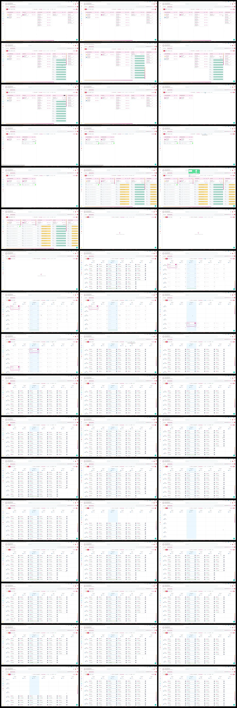

# Video timeline

**Source:** `120739-20260729-1641-27.5946892.mp4`  
**Duration:** 102.033333 seconds  
**Video:** h264, 1910x996

## Contact sheet

## Timeline

| Frame | Timestamp | Review status | Environment | Role | Visual observation | Evidence |
|---|---:|---|---|---|---|---|
| `frames/frame-0001.webp` | `00:00:00.033` | Unreviewed |  |  |  |  |
| `frames/frame-0002.webp` | `00:00:02.067` | Unreviewed |  |  |  |  |
| `frames/frame-0003.webp` | `00:00:04.100` | Unreviewed |  |  |  |  |
| `frames/frame-0004.webp` | `00:00:06.100` | Unreviewed |  |  |  |  |
| `frames/frame-0005.webp` | `00:00:08.133` | Unreviewed |  |  |  |  |
| `frames/frame-0006.webp` | `00:00:10.133` | Unreviewed |  |  |  |  |
| `frames/frame-0007.webp` | `00:00:12.133` | Unreviewed |  |  |  |  |
| `frames/frame-0008.webp` | `00:00:14.133` | Unreviewed |  |  |  |  |
| `frames/frame-0009.webp` | `00:00:16.167` | Unreviewed |  |  |  |  |
| `frames/frame-0010.webp` | `00:00:18.167` | Unreviewed |  |  |  |  |
| `frames/frame-0011.webp` | `00:00:20.167` | Unreviewed |  |  |  |  |
| `frames/frame-0012.webp` | `00:00:22.167` | Unreviewed |  |  |  |  |
| `frames/frame-0013.webp` | `00:00:24.167` | Unreviewed |  |  |  |  |
| `frames/frame-0014.webp` | `00:00:26.167` | Unreviewed |  |  |  |  |
| `frames/frame-0015.webp` | `00:00:28.167` | Unreviewed |  |  |  |  |
| `frames/frame-0016.webp` | `00:00:30.167` | Unreviewed |  |  |  |  |
| `frames/frame-0017.webp` | `00:00:32.167` | Unreviewed |  |  |  |  |
| `frames/frame-0018.webp` | `00:00:34.167` | Unreviewed |  |  |  |  |
| `frames/frame-0019.webp` | `00:00:36.167` | Unreviewed |  |  |  |  |
| `frames/frame-0020.webp` | `00:00:38.167` | Unreviewed |  |  |  |  |
| `frames/frame-0021.webp` | `00:00:40.167` | Unreviewed |  |  |  |  |
| `frames/frame-0022.webp` | `00:00:42.167` | Unreviewed |  |  |  |  |
| `frames/frame-0023.webp` | `00:00:44.167` | Unreviewed |  |  |  |  |
| `frames/frame-0024.webp` | `00:00:46.167` | Unreviewed |  |  |  |  |
| `frames/frame-0025.webp` | `00:00:48.167` | Unreviewed |  |  |  |  |
| `frames/frame-0026.webp` | `00:00:50.167` | Unreviewed |  |  |  |  |
| `frames/frame-0027.webp` | `00:00:52.167` | Unreviewed |  |  |  |  |
| `frames/frame-0028.webp` | `00:00:54.167` | Unreviewed |  |  |  |  |
| `frames/frame-0029.webp` | `00:00:56.167` | Unreviewed |  |  |  |  |
| `frames/frame-0030.webp` | `00:00:58.167` | Unreviewed |  |  |  |  |
| `frames/frame-0031.webp` | `00:01:00.167` | Unreviewed |  |  |  |  |
| `frames/frame-0032.webp` | `00:01:02.167` | Unreviewed |  |  |  |  |
| `frames/frame-0033.webp` | `00:01:04.167` | Unreviewed |  |  |  |  |
| `frames/frame-0034.webp` | `00:01:06.167` | Unreviewed |  |  |  |  |
| `frames/frame-0035.webp` | `00:01:08.167` | Unreviewed |  |  |  |  |
| `frames/frame-0036.webp` | `00:01:10.167` | Unreviewed |  |  |  |  |
| `frames/frame-0037.webp` | `00:01:12.167` | Unreviewed |  |  |  |  |
| `frames/frame-0038.webp` | `00:01:14.167` | Unreviewed |  |  |  |  |
| `frames/frame-0039.webp` | `00:01:16.167` | Unreviewed |  |  |  |  |
| `frames/frame-0040.webp` | `00:01:18.167` | Unreviewed |  |  |  |  |
| `frames/frame-0041.webp` | `00:01:20.167` | Unreviewed |  |  |  |  |
| `frames/frame-0042.webp` | `00:01:22.167` | Unreviewed |  |  |  |  |
| `frames/frame-0043.webp` | `00:01:24.167` | Unreviewed |  |  |  |  |
| `frames/frame-0044.webp` | `00:01:26.167` | Unreviewed |  |  |  |  |
| `frames/frame-0045.webp` | `00:01:28.167` | Unreviewed |  |  |  |  |
| `frames/frame-0046.webp` | `00:01:30.167` | Unreviewed |  |  |  |  |
| `frames/frame-0047.webp` | `00:01:32.167` | Unreviewed |  |  |  |  |
| `frames/frame-0048.webp` | `00:01:34.167` | Unreviewed |  |  |  |  |
| `frames/frame-0049.webp` | `00:01:36.167` | Unreviewed |  |  |  |  |
| `frames/frame-0050.webp` | `00:01:38.167` | Unreviewed |  |  |  |  |
| `frames/frame-0051.webp` | `00:01:40.167` | Unreviewed |  |  |  |  |

Frame timestamps are technical extraction aids. Record `Observed` only after visual review adds environment, role, observation and evidence reference.

## Open questions

- Review each frame before using it as requirement evidence.

## Tester notes

[Protected area]
