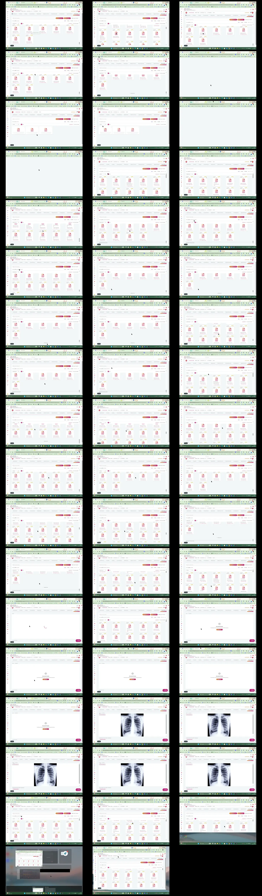

# Video timeline

**Source:** `119150-Screen sharing - 2026-07-16 9_56_50 PM.mp4`  
**Duration:** 103.244733 seconds  
**Video:** h264, 1920x1080

## Contact sheet

## Timeline

| Frame | Timestamp | Review status | Environment | Role | Visual observation | Evidence |
|---|---:|---|---|---|---|---|
| `frames/frame-0001.webp` | `00:00:00.000` | Unreviewed |  |  |  |  |
| `frames/frame-0002.webp` | `00:00:02.017` | Unreviewed |  |  |  |  |
| `frames/frame-0003.webp` | `00:00:04.035` | Unreviewed |  |  |  |  |
| `frames/frame-0004.webp` | `00:00:06.039` | Unreviewed |  |  |  |  |
| `frames/frame-0005.webp` | `00:00:08.061` | Unreviewed |  |  |  |  |
| `frames/frame-0006.webp` | `00:00:10.076` | Unreviewed |  |  |  |  |
| `frames/frame-0007.webp` | `00:00:12.097` | Unreviewed |  |  |  |  |
| `frames/frame-0008.webp` | `00:00:14.103` | Unreviewed |  |  |  |  |
| `frames/frame-0009.webp` | `00:00:16.119` | Unreviewed |  |  |  |  |
| `frames/frame-0010.webp` | `00:00:18.124` | Unreviewed |  |  |  |  |
| `frames/frame-0011.webp` | `00:00:20.139` | Unreviewed |  |  |  |  |
| `frames/frame-0012.webp` | `00:00:22.163` | Unreviewed |  |  |  |  |
| `frames/frame-0013.webp` | `00:00:24.182` | Unreviewed |  |  |  |  |
| `frames/frame-0014.webp` | `00:00:26.213` | Unreviewed |  |  |  |  |
| `frames/frame-0015.webp` | `00:00:28.222` | Unreviewed |  |  |  |  |
| `frames/frame-0016.webp` | `00:00:30.249` | Unreviewed |  |  |  |  |
| `frames/frame-0017.webp` | `00:00:32.249` | Unreviewed |  |  |  |  |
| `frames/frame-0018.webp` | `00:00:34.279` | Unreviewed |  |  |  |  |
| `frames/frame-0019.webp` | `00:00:36.300` | Unreviewed |  |  |  |  |
| `frames/frame-0020.webp` | `00:00:38.322` | Unreviewed |  |  |  |  |
| `frames/frame-0021.webp` | `00:00:40.324` | Unreviewed |  |  |  |  |
| `frames/frame-0022.webp` | `00:00:42.379` | Unreviewed |  |  |  |  |
| `frames/frame-0023.webp` | `00:00:44.380` | Unreviewed |  |  |  |  |
| `frames/frame-0024.webp` | `00:00:46.410` | Unreviewed |  |  |  |  |
| `frames/frame-0025.webp` | `00:00:48.414` | Unreviewed |  |  |  |  |
| `frames/frame-0026.webp` | `00:00:50.443` | Unreviewed |  |  |  |  |
| `frames/frame-0027.webp` | `00:00:52.468` | Unreviewed |  |  |  |  |
| `frames/frame-0028.webp` | `00:00:54.474` | Unreviewed |  |  |  |  |
| `frames/frame-0029.webp` | `00:00:56.477` | Unreviewed |  |  |  |  |
| `frames/frame-0030.webp` | `00:00:58.502` | Unreviewed |  |  |  |  |
| `frames/frame-0031.webp` | `00:01:00.520` | Unreviewed |  |  |  |  |
| `frames/frame-0032.webp` | `00:01:02.527` | Unreviewed |  |  |  |  |
| `frames/frame-0033.webp` | `00:01:04.556` | Unreviewed |  |  |  |  |
| `frames/frame-0034.webp` | `00:01:06.560` | Unreviewed |  |  |  |  |
| `frames/frame-0035.webp` | `00:01:08.571` | Unreviewed |  |  |  |  |
| `frames/frame-0036.webp` | `00:01:10.588` | Unreviewed |  |  |  |  |
| `frames/frame-0037.webp` | `00:01:12.602` | Unreviewed |  |  |  |  |
| `frames/frame-0038.webp` | `00:01:14.610` | Unreviewed |  |  |  |  |
| `frames/frame-0039.webp` | `00:01:16.627` | Unreviewed |  |  |  |  |
| `frames/frame-0040.webp` | `00:01:18.647` | Unreviewed |  |  |  |  |
| `frames/frame-0041.webp` | `00:01:20.648` | Unreviewed |  |  |  |  |
| `frames/frame-0042.webp` | `00:01:22.662` | Unreviewed |  |  |  |  |
| `frames/frame-0043.webp` | `00:01:24.737` | Unreviewed |  |  |  |  |
| `frames/frame-0044.webp` | `00:01:26.760` | Unreviewed |  |  |  |  |
| `frames/frame-0045.webp` | `00:01:28.816` | Unreviewed |  |  |  |  |
| `frames/frame-0046.webp` | `00:01:31.153` | Unreviewed |  |  |  |  |
| `frames/frame-0047.webp` | `00:01:33.155` | Unreviewed |  |  |  |  |
| `frames/frame-0048.webp` | `00:01:35.170` | Unreviewed |  |  |  |  |
| `frames/frame-0049.webp` | `00:01:37.189` | Unreviewed |  |  |  |  |
| `frames/frame-0050.webp` | `00:01:39.204` | Unreviewed |  |  |  |  |
| `frames/frame-0051.webp` | `00:01:40.735` | Unreviewed |  |  |  |  |
| `frames/frame-0052.webp` | `00:01:40.827` | Unreviewed |  |  |  |  |
| `frames/frame-0053.webp` | `00:01:41.819` | Unreviewed |  |  |  |  |

Frame timestamps are technical extraction aids. Record `Observed` only after visual review adds environment, role, observation and evidence reference.

## Open questions

- Review each frame before using it as requirement evidence.

## Tester notes

[Protected area]
