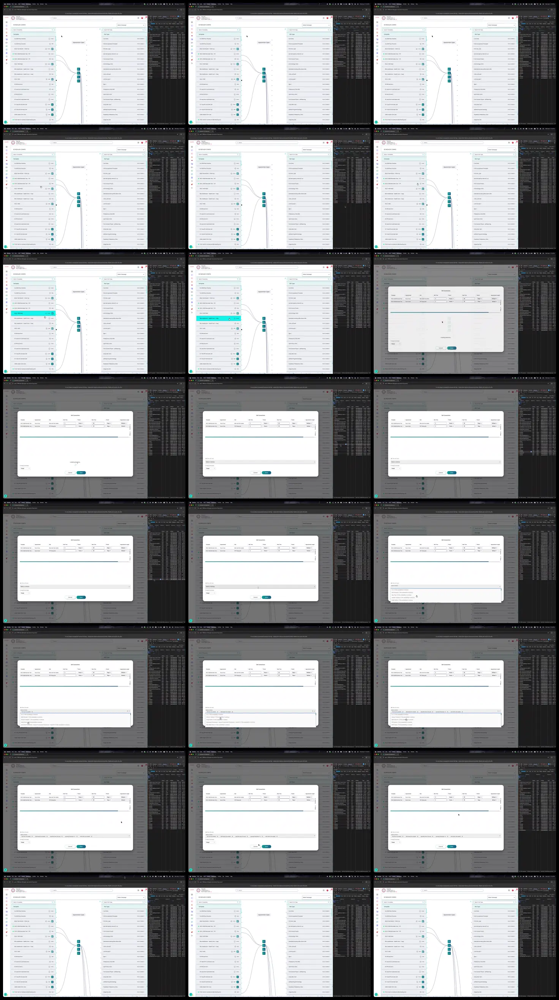

# Video timeline

**Source:** `126418-Screen Recording 2026-09-09 at 10.31.56 PM.mov`  
**Duration:** 59.251833 seconds  
**Video:** h264, 4096x2732

## Contact sheet

## Timeline

| Frame | Timestamp | Review status | Environment | Role | Visual observation | Evidence |
|---|---:|---|---|---|---|---|
| `frames/frame-0001.webp` | `00:00:00.000` | Unreviewed |  |  |  |  |
| `frames/frame-0002.webp` | `00:00:02.733` | Unreviewed |  |  |  |  |
| `frames/frame-0003.webp` | `00:00:09.537` | Unreviewed |  |  |  |  |
| `frames/frame-0004.webp` | `00:00:11.570` | Unreviewed |  |  |  |  |
| `frames/frame-0005.webp` | `00:00:13.570` | Unreviewed |  |  |  |  |
| `frames/frame-0006.webp` | `00:00:16.405` | Unreviewed |  |  |  |  |
| `frames/frame-0007.webp` | `00:00:18.405` | Unreviewed |  |  |  |  |
| `frames/frame-0008.webp` | `00:00:20.405` | Unreviewed |  |  |  |  |
| `frames/frame-0009.webp` | `00:00:22.257` | Unreviewed |  |  |  |  |
| `frames/frame-0010.webp` | `00:00:24.257` | Unreviewed |  |  |  |  |
| `frames/frame-0011.webp` | `00:00:26.257` | Unreviewed |  |  |  |  |
| `frames/frame-0012.webp` | `00:00:28.258` | Unreviewed |  |  |  |  |
| `frames/frame-0013.webp` | `00:00:30.275` | Unreviewed |  |  |  |  |
| `frames/frame-0014.webp` | `00:00:32.292` | Unreviewed |  |  |  |  |
| `frames/frame-0015.webp` | `00:00:34.293` | Unreviewed |  |  |  |  |
| `frames/frame-0016.webp` | `00:00:36.310` | Unreviewed |  |  |  |  |
| `frames/frame-0017.webp` | `00:00:38.310` | Unreviewed |  |  |  |  |
| `frames/frame-0018.webp` | `00:00:40.312` | Unreviewed |  |  |  |  |
| `frames/frame-0019.webp` | `00:00:42.445` | Unreviewed |  |  |  |  |
| `frames/frame-0020.webp` | `00:00:44.445` | Unreviewed |  |  |  |  |
| `frames/frame-0021.webp` | `00:00:46.447` | Unreviewed |  |  |  |  |
| `frames/frame-0022.webp` | `00:00:48.478` | Unreviewed |  |  |  |  |
| `frames/frame-0023.webp` | `00:00:50.478` | Unreviewed |  |  |  |  |
| `frames/frame-0024.webp` | `00:00:59.183` | Unreviewed |  |  |  |  |

Frame timestamps are technical extraction aids. Record `Observed` only after visual review adds environment, role, observation and evidence reference.

## Open questions

- Review each frame before using it as requirement evidence.

## Tester notes

[Protected area]
