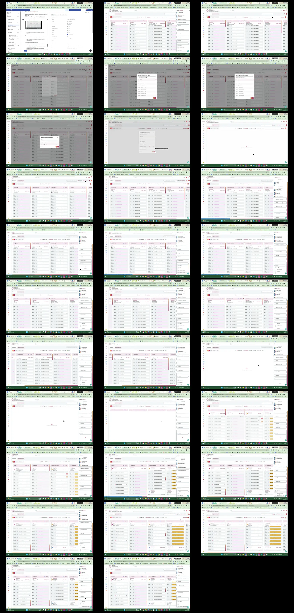

# Video timeline

**Source:** `126786-Screen sharing - 2026-08-21 2_48_41 PM.mp4`  
**Duration:** 60.486067 seconds  
**Video:** h264, 1920x1080

## Contact sheet

## Timeline

| Frame | Timestamp | Review status | Environment | Role | Visual observation | Evidence |
|---|---:|---|---|---|---|---|
| `frames/frame-0001.webp` | `00:00:00.000` | Unreviewed |  |  |  |  |
| `frames/frame-0002.webp` | `00:00:02.028` | Unreviewed |  |  |  |  |
| `frames/frame-0003.webp` | `00:00:04.054` | Unreviewed |  |  |  |  |
| `frames/frame-0004.webp` | `00:00:06.071` | Unreviewed |  |  |  |  |
| `frames/frame-0005.webp` | `00:00:08.084` | Unreviewed |  |  |  |  |
| `frames/frame-0006.webp` | `00:00:10.123` | Unreviewed |  |  |  |  |
| `frames/frame-0007.webp` | `00:00:12.159` | Unreviewed |  |  |  |  |
| `frames/frame-0008.webp` | `00:00:13.776` | Unreviewed |  |  |  |  |
| `frames/frame-0009.webp` | `00:00:13.835` | Unreviewed |  |  |  |  |
| `frames/frame-0010.webp` | `00:00:15.855` | Unreviewed |  |  |  |  |
| `frames/frame-0011.webp` | `00:00:17.871` | Unreviewed |  |  |  |  |
| `frames/frame-0012.webp` | `00:00:19.891` | Unreviewed |  |  |  |  |
| `frames/frame-0013.webp` | `00:00:21.913` | Unreviewed |  |  |  |  |
| `frames/frame-0014.webp` | `00:00:23.943` | Unreviewed |  |  |  |  |
| `frames/frame-0015.webp` | `00:00:25.969` | Unreviewed |  |  |  |  |
| `frames/frame-0016.webp` | `00:00:27.976` | Unreviewed |  |  |  |  |
| `frames/frame-0017.webp` | `00:00:29.992` | Unreviewed |  |  |  |  |
| `frames/frame-0018.webp` | `00:00:32.019` | Unreviewed |  |  |  |  |
| `frames/frame-0019.webp` | `00:00:34.042` | Unreviewed |  |  |  |  |
| `frames/frame-0020.webp` | `00:00:36.066` | Unreviewed |  |  |  |  |
| `frames/frame-0021.webp` | `00:00:38.083` | Unreviewed |  |  |  |  |
| `frames/frame-0022.webp` | `00:00:40.108` | Unreviewed |  |  |  |  |
| `frames/frame-0023.webp` | `00:00:42.136` | Unreviewed |  |  |  |  |
| `frames/frame-0024.webp` | `00:00:44.150` | Unreviewed |  |  |  |  |
| `frames/frame-0025.webp` | `00:00:46.179` | Unreviewed |  |  |  |  |
| `frames/frame-0026.webp` | `00:00:48.191` | Unreviewed |  |  |  |  |
| `frames/frame-0027.webp` | `00:00:50.208` | Unreviewed |  |  |  |  |
| `frames/frame-0028.webp` | `00:00:52.239` | Unreviewed |  |  |  |  |
| `frames/frame-0029.webp` | `00:00:54.257` | Unreviewed |  |  |  |  |
| `frames/frame-0030.webp` | `00:00:56.271` | Unreviewed |  |  |  |  |
| `frames/frame-0031.webp` | `00:00:58.283` | Unreviewed |  |  |  |  |
| `frames/frame-0032.webp` | `00:01:00.301` | Unreviewed |  |  |  |  |

Frame timestamps are technical extraction aids. Record `Observed` only after visual review adds environment, role, observation and evidence reference.

## Open questions

- Review each frame before using it as requirement evidence.

## Tester notes

[Protected area]
