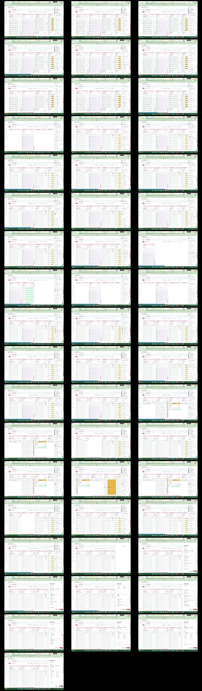

# Video timeline

**Source:** `126787-Screen sharing - 2026-08-21 2_51_08 PM.mp4`  
**Duration:** 103.352233 seconds  
**Video:** h264, 1920x1080

## Contact sheet

## Timeline

| Frame | Timestamp | Review status | Environment | Role | Visual observation | Evidence |
|---|---:|---|---|---|---|---|
| `frames/frame-0001.webp` | `00:00:00.000` | Unreviewed |  |  |  |  |
| `frames/frame-0002.webp` | `00:00:02.019` | Unreviewed |  |  |  |  |
| `frames/frame-0003.webp` | `00:00:04.036` | Unreviewed |  |  |  |  |
| `frames/frame-0004.webp` | `00:00:06.051` | Unreviewed |  |  |  |  |
| `frames/frame-0005.webp` | `00:00:08.073` | Unreviewed |  |  |  |  |
| `frames/frame-0006.webp` | `00:00:10.088` | Unreviewed |  |  |  |  |
| `frames/frame-0007.webp` | `00:00:12.108` | Unreviewed |  |  |  |  |
| `frames/frame-0008.webp` | `00:00:14.112` | Unreviewed |  |  |  |  |
| `frames/frame-0009.webp` | `00:00:16.156` | Unreviewed |  |  |  |  |
| `frames/frame-0010.webp` | `00:00:18.175` | Unreviewed |  |  |  |  |
| `frames/frame-0011.webp` | `00:00:20.185` | Unreviewed |  |  |  |  |
| `frames/frame-0012.webp` | `00:00:22.199` | Unreviewed |  |  |  |  |
| `frames/frame-0013.webp` | `00:00:24.215` | Unreviewed |  |  |  |  |
| `frames/frame-0014.webp` | `00:00:26.233` | Unreviewed |  |  |  |  |
| `frames/frame-0015.webp` | `00:00:28.286` | Unreviewed |  |  |  |  |
| `frames/frame-0016.webp` | `00:00:30.309` | Unreviewed |  |  |  |  |
| `frames/frame-0017.webp` | `00:00:32.356` | Unreviewed |  |  |  |  |
| `frames/frame-0018.webp` | `00:00:34.382` | Unreviewed |  |  |  |  |
| `frames/frame-0019.webp` | `00:00:36.407` | Unreviewed |  |  |  |  |
| `frames/frame-0020.webp` | `00:00:38.436` | Unreviewed |  |  |  |  |
| `frames/frame-0021.webp` | `00:00:40.454` | Unreviewed |  |  |  |  |
| `frames/frame-0022.webp` | `00:00:42.476` | Unreviewed |  |  |  |  |
| `frames/frame-0023.webp` | `00:00:44.490` | Unreviewed |  |  |  |  |
| `frames/frame-0024.webp` | `00:00:46.514` | Unreviewed |  |  |  |  |
| `frames/frame-0025.webp` | `00:00:48.533` | Unreviewed |  |  |  |  |
| `frames/frame-0026.webp` | `00:00:50.546` | Unreviewed |  |  |  |  |
| `frames/frame-0027.webp` | `00:00:52.587` | Unreviewed |  |  |  |  |
| `frames/frame-0028.webp` | `00:00:54.603` | Unreviewed |  |  |  |  |
| `frames/frame-0029.webp` | `00:00:56.655` | Unreviewed |  |  |  |  |
| `frames/frame-0030.webp` | `00:00:58.681` | Unreviewed |  |  |  |  |
| `frames/frame-0031.webp` | `00:01:00.705` | Unreviewed |  |  |  |  |
| `frames/frame-0032.webp` | `00:01:02.717` | Unreviewed |  |  |  |  |
| `frames/frame-0033.webp` | `00:01:04.754` | Unreviewed |  |  |  |  |
| `frames/frame-0034.webp` | `00:01:06.764` | Unreviewed |  |  |  |  |
| `frames/frame-0035.webp` | `00:01:08.777` | Unreviewed |  |  |  |  |
| `frames/frame-0036.webp` | `00:01:10.794` | Unreviewed |  |  |  |  |
| `frames/frame-0037.webp` | `00:01:12.807` | Unreviewed |  |  |  |  |
| `frames/frame-0038.webp` | `00:01:14.828` | Unreviewed |  |  |  |  |
| `frames/frame-0039.webp` | `00:01:16.841` | Unreviewed |  |  |  |  |
| `frames/frame-0040.webp` | `00:01:18.853` | Unreviewed |  |  |  |  |
| `frames/frame-0041.webp` | `00:01:20.874` | Unreviewed |  |  |  |  |
| `frames/frame-0042.webp` | `00:01:22.875` | Unreviewed |  |  |  |  |
| `frames/frame-0043.webp` | `00:01:24.885` | Unreviewed |  |  |  |  |
| `frames/frame-0044.webp` | `00:01:26.904` | Unreviewed |  |  |  |  |
| `frames/frame-0045.webp` | `00:01:28.926` | Unreviewed |  |  |  |  |
| `frames/frame-0046.webp` | `00:01:30.946` | Unreviewed |  |  |  |  |
| `frames/frame-0047.webp` | `00:01:32.987` | Unreviewed |  |  |  |  |
| `frames/frame-0048.webp` | `00:01:34.989` | Unreviewed |  |  |  |  |
| `frames/frame-0049.webp` | `00:01:36.998` | Unreviewed |  |  |  |  |
| `frames/frame-0050.webp` | `00:01:39.015` | Unreviewed |  |  |  |  |
| `frames/frame-0051.webp` | `00:01:41.032` | Unreviewed |  |  |  |  |
| `frames/frame-0052.webp` | `00:01:43.042` | Unreviewed |  |  |  |  |

Frame timestamps are technical extraction aids. Record `Observed` only after visual review adds environment, role, observation and evidence reference.

## Open questions

- Review each frame before using it as requirement evidence.

## Tester notes

[Protected area]
