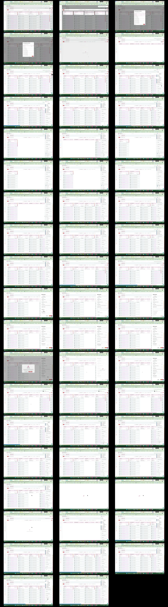

# Video timeline

**Source:** `126788-Screen sharing - 2026-08-21 2_47_02 PM.mp4`  
**Duration:** 108.354233 seconds  
**Video:** h264, 1920x1080

## Contact sheet

## Timeline

| Frame | Timestamp | Review status | Environment | Role | Visual observation | Evidence |
|---|---:|---|---|---|---|---|
| `frames/frame-0001.webp` | `00:00:00.000` | Unreviewed |  |  |  |  |
| `frames/frame-0002.webp` | `00:00:00.043` | Unreviewed |  |  |  |  |
| `frames/frame-0003.webp` | `00:00:02.054` | Unreviewed |  |  |  |  |
| `frames/frame-0004.webp` | `00:00:04.111` | Unreviewed |  |  |  |  |
| `frames/frame-0005.webp` | `00:00:06.094` | Unreviewed |  |  |  |  |
| `frames/frame-0006.webp` | `00:00:08.106` | Unreviewed |  |  |  |  |
| `frames/frame-0007.webp` | `00:00:10.116` | Unreviewed |  |  |  |  |
| `frames/frame-0008.webp` | `00:00:12.139` | Unreviewed |  |  |  |  |
| `frames/frame-0009.webp` | `00:00:14.166` | Unreviewed |  |  |  |  |
| `frames/frame-0010.webp` | `00:00:16.174` | Unreviewed |  |  |  |  |
| `frames/frame-0011.webp` | `00:00:18.190` | Unreviewed |  |  |  |  |
| `frames/frame-0012.webp` | `00:00:20.212` | Unreviewed |  |  |  |  |
| `frames/frame-0013.webp` | `00:00:22.218` | Unreviewed |  |  |  |  |
| `frames/frame-0014.webp` | `00:00:24.237` | Unreviewed |  |  |  |  |
| `frames/frame-0015.webp` | `00:00:26.259` | Unreviewed |  |  |  |  |
| `frames/frame-0016.webp` | `00:00:28.279` | Unreviewed |  |  |  |  |
| `frames/frame-0017.webp` | `00:00:30.288` | Unreviewed |  |  |  |  |
| `frames/frame-0018.webp` | `00:00:32.308` | Unreviewed |  |  |  |  |
| `frames/frame-0019.webp` | `00:00:34.326` | Unreviewed |  |  |  |  |
| `frames/frame-0020.webp` | `00:00:36.341` | Unreviewed |  |  |  |  |
| `frames/frame-0021.webp` | `00:00:38.361` | Unreviewed |  |  |  |  |
| `frames/frame-0022.webp` | `00:00:40.373` | Unreviewed |  |  |  |  |
| `frames/frame-0023.webp` | `00:00:42.405` | Unreviewed |  |  |  |  |
| `frames/frame-0024.webp` | `00:00:44.442` | Unreviewed |  |  |  |  |
| `frames/frame-0025.webp` | `00:00:46.456` | Unreviewed |  |  |  |  |
| `frames/frame-0026.webp` | `00:00:48.471` | Unreviewed |  |  |  |  |
| `frames/frame-0027.webp` | `00:00:50.507` | Unreviewed |  |  |  |  |
| `frames/frame-0028.webp` | `00:00:52.523` | Unreviewed |  |  |  |  |
| `frames/frame-0029.webp` | `00:00:54.573` | Unreviewed |  |  |  |  |
| `frames/frame-0030.webp` | `00:00:56.592` | Unreviewed |  |  |  |  |
| `frames/frame-0031.webp` | `00:00:58.607` | Unreviewed |  |  |  |  |
| `frames/frame-0032.webp` | `00:01:00.628` | Unreviewed |  |  |  |  |
| `frames/frame-0033.webp` | `00:01:02.651` | Unreviewed |  |  |  |  |
| `frames/frame-0034.webp` | `00:01:03.229` | Unreviewed |  |  |  |  |
| `frames/frame-0035.webp` | `00:01:04.457` | Unreviewed |  |  |  |  |
| `frames/frame-0036.webp` | `00:01:06.466` | Unreviewed |  |  |  |  |
| `frames/frame-0037.webp` | `00:01:08.469` | Unreviewed |  |  |  |  |
| `frames/frame-0038.webp` | `00:01:10.497` | Unreviewed |  |  |  |  |
| `frames/frame-0039.webp` | `00:01:12.543` | Unreviewed |  |  |  |  |
| `frames/frame-0040.webp` | `00:01:14.559` | Unreviewed |  |  |  |  |
| `frames/frame-0041.webp` | `00:01:16.574` | Unreviewed |  |  |  |  |
| `frames/frame-0042.webp` | `00:01:18.588` | Unreviewed |  |  |  |  |
| `frames/frame-0043.webp` | `00:01:20.616` | Unreviewed |  |  |  |  |
| `frames/frame-0044.webp` | `00:01:22.642` | Unreviewed |  |  |  |  |
| `frames/frame-0045.webp` | `00:01:24.647` | Unreviewed |  |  |  |  |
| `frames/frame-0046.webp` | `00:01:26.660` | Unreviewed |  |  |  |  |
| `frames/frame-0047.webp` | `00:01:28.681` | Unreviewed |  |  |  |  |
| `frames/frame-0048.webp` | `00:01:30.694` | Unreviewed |  |  |  |  |
| `frames/frame-0049.webp` | `00:01:32.721` | Unreviewed |  |  |  |  |
| `frames/frame-0050.webp` | `00:01:34.736` | Unreviewed |  |  |  |  |
| `frames/frame-0051.webp` | `00:01:36.773` | Unreviewed |  |  |  |  |
| `frames/frame-0052.webp` | `00:01:38.799` | Unreviewed |  |  |  |  |
| `frames/frame-0053.webp` | `00:01:40.814` | Unreviewed |  |  |  |  |
| `frames/frame-0054.webp` | `00:01:42.833` | Unreviewed |  |  |  |  |
| `frames/frame-0055.webp` | `00:01:44.843` | Unreviewed |  |  |  |  |
| `frames/frame-0056.webp` | `00:01:46.863` | Unreviewed |  |  |  |  |

Frame timestamps are technical extraction aids. Record `Observed` only after visual review adds environment, role, observation and evidence reference.

## Open questions

- Review each frame before using it as requirement evidence.

## Tester notes

[Protected area]
